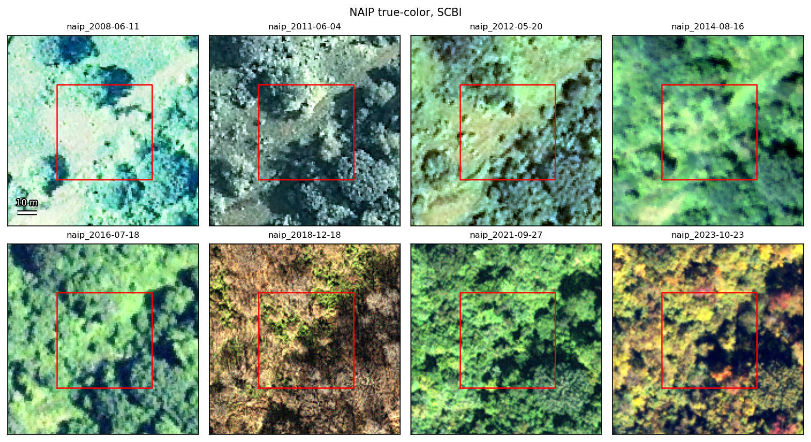
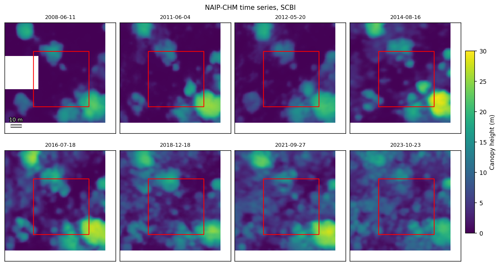
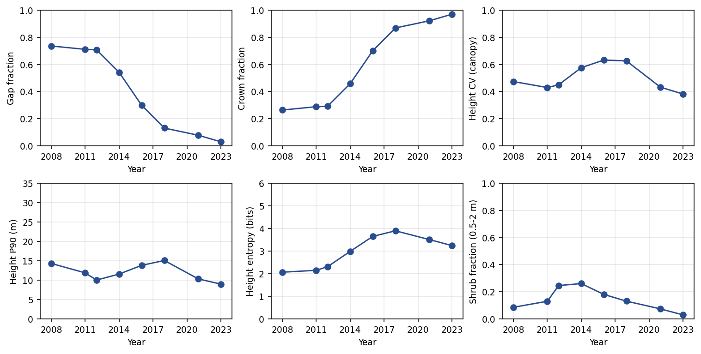
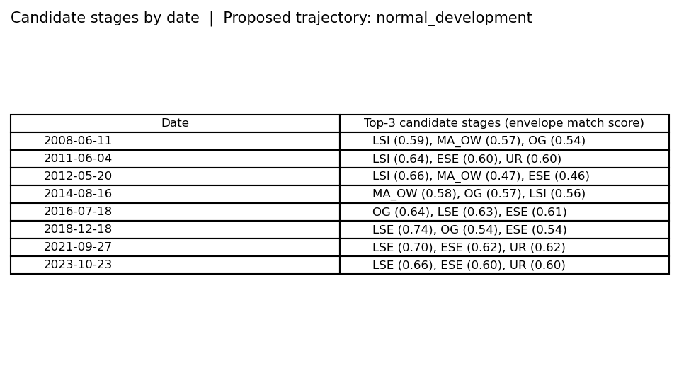

# CSDV: Eastern US Forest Disturbance and Recovery Mapping

This repository develops a method for mapping forest disturbance and post-disturbance recovery across the eastern United States. The approach extracts stand-level structural metrics from multi-temporal NAIP aerial imagery (0.6 m, four-band RGBN) and NAIP-derived canopy height models, then applies a rule-based classifier that assigns each stand an Oliver-Larson developmental stage at every imagery date and tracks how those stages change through time. The work is carried out by a university remote sensing group as a sub-contract to a forest disturbance mapping project funded by the USDA Natural Resources Conservation Service through Pheasants Forever.

The central idea is that 0.6 m imagery resolves individual tree crowns and canopy gaps, which connects directly to decades of stand development theory. Crown width distributions, gap fraction, and texture measured from NAIP can be compared against established expectations for how forest structure changes through development. Departures from those expectations become diagnostic of specific disturbance types, management histories, and recovery outcomes.

## Status

This is a proof-of-concept and is very much in development. The code in this repository is essentially a test of the project's classification system. iIt checks whether the structural metrics the classifier needs can be reliably extracted from NAIP and whether they separate developmental stages cleanly. The metrics are evaluated against airborne lidar benchmarks at NEON sites (SCBI in Virginia, Harvard Forest in Massachusetts, Talladega in Alabama).

Everything here is preliminary and unpublished. The classification thresholds and rule logic have not been calibrated, so all stage and trajectory assignments shown below are tentative illustrations of the workflow rather than validated results.

## How the classification system works

### Layer 1: Ecological stratification

Forest structure at a given developmental stage depends on the site. A productive cove and a dry ridge reach canopy closure at different rates and settle at different structural conditions. Every location is therefore assigned one of 13 site types defined by landscape position, parent material, topographic wetness, and soils. Classification thresholds are expressed relative to each site type rather than as fixed absolute values.

| Group | Site types |
|---|---|
| Hydric and riparian | Floodplain / riparian hydric; upland seep / depression hydric |
| Low-relief wet | Wet-mesic flats / lake plain clay |
| Glacial and sandy | Glacial sand plain / outwash xeric |
| Upland mesic | Till upland mesic; cove / concave mesic; lower slope / bench mesic |
| Mountain | Upper slope north-facing cool mesic; ridge / convex xeric; south-facing xeric slope; toe-slope / hollow wet mesic |
| Geologic productivity | Limestone / karst mesic-productive; sandstone / shale upland dry-mesic |

### Layer 2: Stand development stage

At each NAIP date, a stand is assigned one of seven developmental stages from the Oliver-Larson stand dynamics model. Each stage has a characteristic structural signature in the metrics.

| Stage | Code | Structural signature |
|---|---|---|
| Early Stand Initiation | ESI | Open ground, scattered seedlings, very high gap fraction |
| Late Stand Initiation | LSI | Woody plants establishing, shrub layer present, gap fraction declining |
| Early Stem Exclusion | ESE | Canopy closing, crown fraction rising, competition and self-thinning beginning |
| Late Stem Exclusion | LSE | Dense uniform canopy, low gap fraction, low crown size variability, low entropy |
| Understory Reinitiation | UR | Crown size variability and entropy rising, small gaps forming, understory developing |
| Mature Forest / Open Woodland | MA/OW | Stable moderate-to-high heterogeneity; gap persistence separates closed forest from open woodland |
| Old Growth | OG | High crown size variability, broad crown size distribution, persistent heterogeneity |

### Layer 3: Trajectory

The classifier then tracks how stage assignments change across the full NAIP record. A sequence that follows the expected progression for its site type is normal development. Sequences that depart from it are assigned to one of four trajectory groups.

| Trajectory group | What it captures | Representative classes |
|---|---|---|
| Development stagnation | Stand stays in a stage longer than expected or fails to gain expected structural complexity | Beech bark disease sprout trap; chronic defoliation stagnation |
| Tree establishment failure | Tree crowns fail to develop after disturbance because herb or shrub cover persists | Fern / graminoid dominance; ericaceous shrub thicket |
| Non-forest land conversion | Conditions stay persistently non-forest and outside all stage envelopes | Agriculture; pasture; development; surface mining; utility corridor |
| Undesirable forest type conversion | Forest develops, but with structure that departs from natural stands | Invasive tree dominance; row-structured plantation; even-aged plantation |

A parallel vocabulary describes the disturbances and management activities that drive these transitions, grouped into harvest types (for example clearcut, shelterwood, thinning), natural disturbances (wind, fire, insect and disease, drought), and post-disturbance management flags (planting, salvage, scarification).

## Primary diagnostic metrics

The system inventories many candidate metrics. A smaller set appears most often in the classification logic and drives the worked example below.

| Metric | Source |
|---|---|
| Gap fraction | NAIP-CHM height threshold |
| Crown fraction | NAIP-CHM height threshold |
| Crown width CV | Crown segmentation |
| Crown width P90 | Crown segmentation |
| Texture entropy | GLCM on NAIP pixel values |
| Shrub / low woody fraction | NAIP spectral and height bands |
| Gap persistence | Multi-temporal CHM threshold |
| Linearity index | Spatial pattern on the gap mask |

## Example: closing canopy at SCBI, 2008 to 2023

This example walks through the full workflow for a single 50 m window at the SCBI NEON site in northern Virginia, on a mesic till upland. Eight NAIP dates span 2008 to 2023. The disturbance that reset this stand predates the imagery record, so only the recovery limb is observed.

> Note: The code supports both window-level and stand-level analysis. The example here is a window-level analysis, which was developed first for testing. The same workflow applies to the stand level, where the metrics are aggregated across polygons. Production runs will be at the stand level.

### 1. NAIP image strip

Four-band NAIP true-color imagery for the eight dates, with the 50 m analysis window outlined in red. Read left to right, top to bottom, the window fills in from a mostly open surface in 2008 to a closed canopy by 2023.



### 2. Canopy height model strip

The canopy height model is produced from the same NAIP imagery using an open-source deep learning model (Morford et al., 2025; code at `github.com/smorf-ntsg/naip-chm`), so a height model can be generated for any historical NAIP date without lidar at the site. Brighter colors are taller canopy. The window transitions from low, patchy heights to continuous tall canopy across the series.



### 3. Metric trajectory

Structural metrics computed inside the window at each date trace a coherent recovery signal. Gap fraction falls from about 0.74 in 2008 to 0.03 in 2023 while crown fraction rises to about 0.97. Shrub fraction peaks around 2014 as the young cohort passes through the 0.5 to 2 m height band, then collapses as the canopy grows past 2 m. Height entropy peaks around 2018, when canopy and gap pixels are most evenly mixed, and falls once the window is uniformly closed.



### 4. Classification summary

The metrics at each date map to a developmental stage, and the full sequence maps to a trajectory. Here the stand moves from Late Stand Initiation through Early and Late Stem Exclusion, the canonical signature of a regenerating cohort closing canopy.

| Date | Stage |
|---|---|
| 2008-06-11 | LSI |
| 2011-06-04 | LSI |
| 2012-05-20 | ESE |
| 2014-08-16 | ESE |
| 2016-07-18 | ESE |
| 2018-12-18 | ESE |
| 2021-09-27 | LSE |
| 2023-10-23 | LSE |

Proposed trajectory: **normal development**. The figure below shows the ranked candidate stages the classifier considered at each date alongside the proposed trajectory.



These assignments are tentative. They illustrate the metric extraction to stage to trajectory flow that the project implements, but the underlying thresholds still need calibration against the lidar benchmarks.

## Quickstart

```bash
micromamba env create -f environment.yml -n csdv
micromamba activate csdv
pip install -e ".[dev]"
pytest
csdv --help
```

## Documentation

For detailed guides, API references, and data structures, please refer to the following documentation files (in development):

* [**Architecture**](docs/architecture.md) — describes the library's structure, including the main modules and their responsibilities.
* [**Metrics**](docs/metrics.md) — describes the structural metrics extracted from NAIP and NAIP-CHM rasters, including their definitions, units, examples, and how they are computed.
* [**Data layout**](docs/data_layout.md) — describes the expected layout of the `data/` and `results/` directories, including the purpose of each subdirectory and how to configure the environment variables that control their locations.

## Repository layout

```
src/csdv_core/    # the library
scripts/          # batch entry points for cluster and Colab runs
notebooks/        # exploration
tests/            # pytest
docs/             # workflow and data layout notes
```

## References

- Oliver, C. D. and Larson, B. C. (1996). *Forest Stand Dynamics.* Wiley.
- Morford, S. L. et al. (2025). A 0.6-meter resolution canopy height and structure model for the contiguous United States. *bioRxiv*. Code: `github.com/smorf-ntsg/naip-chm`.
