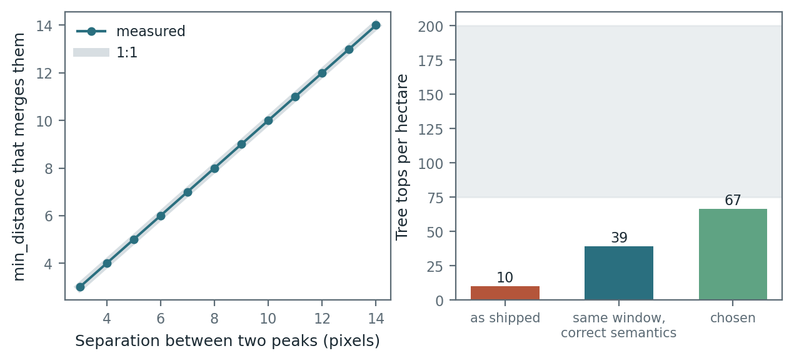
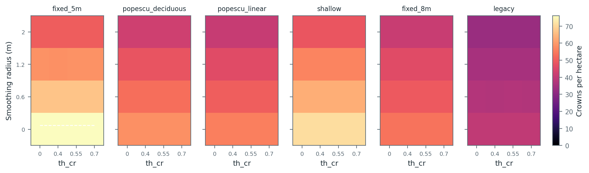
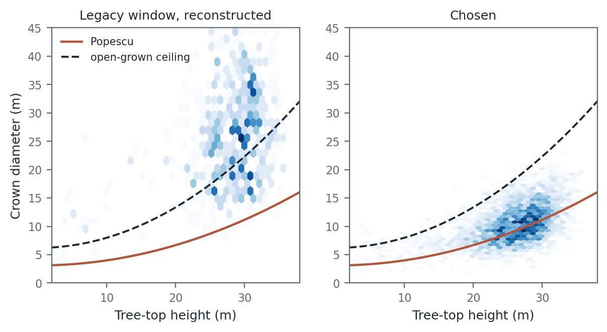
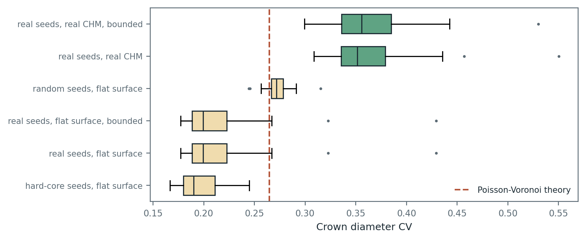
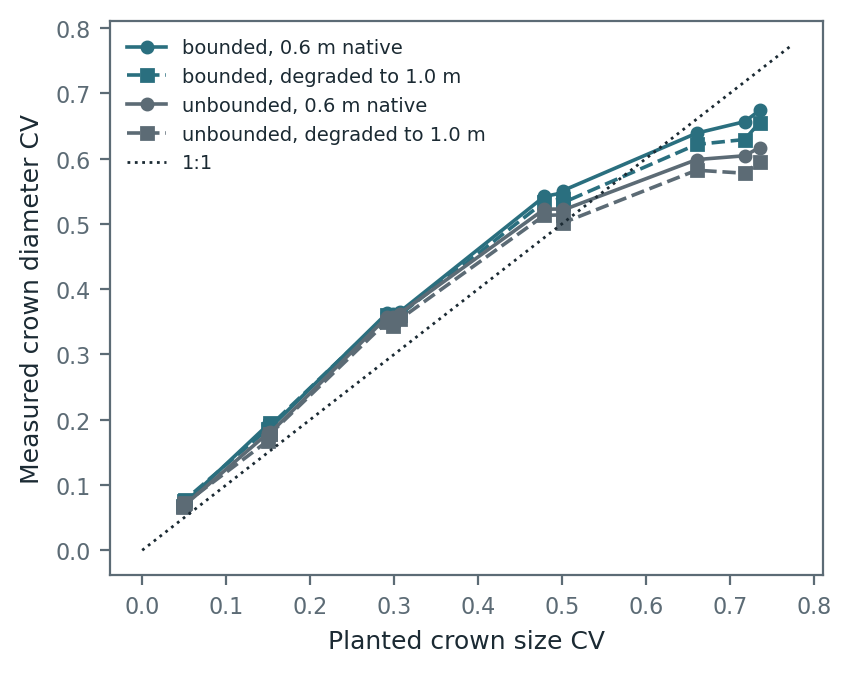
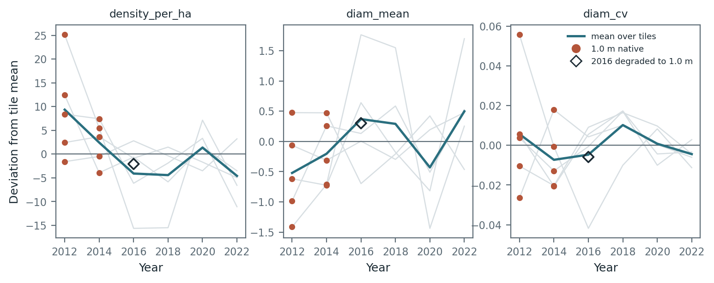
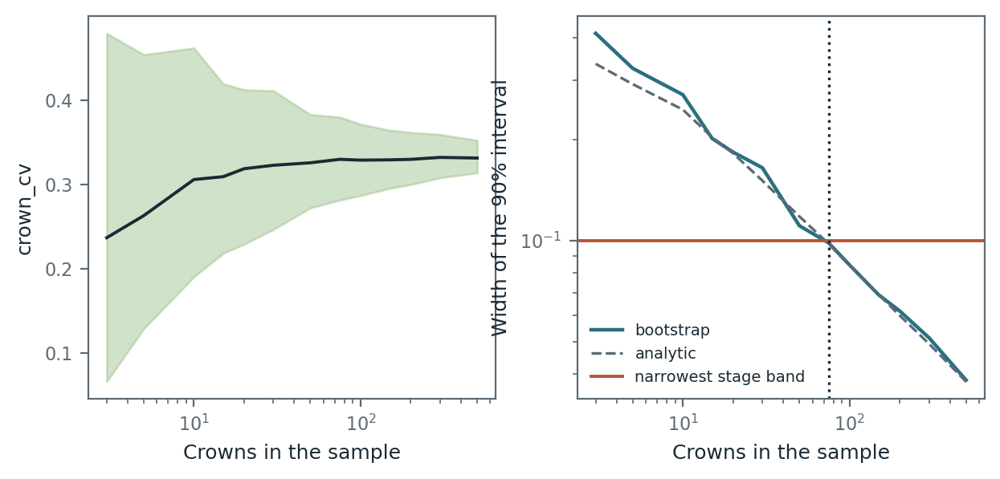

# Crown segmentation: what was wrong and how it was re-tuned

## Summary and decision

Crown segments used to be canopy clusters rather than trees. They averaged 33 m across at about 10 per hectare, where an eastern hardwood stand carries 200 to 600 stems, and every crown metric inherited that. `crown_cv` read about 0.33 on every stand large enough for the value to be stable.

Three separate faults produced it, and only one was the window-size equation everyone suspected.

The chosen parameters:

| Parameter | Value | Why |
|---|---|---|
| `window` | fixed 5 m diameter | Height-scaled windows found too few crowns on this canopy height model |
| `smooth_radius_m` | 0.6 | Holds crown count steady across sensors. See the note below |
| `th_cr` | 0.70 | Stops a crown where its own canopy falls away, which breaks full tiling |
| `max_crown_radius_m` | 12.0 | Guard rail. It shapes 6 percent of crowns, so it is not doing the work |
| `MIN_CROWNS` | 75 | The count at which the crown_cv interval fits inside the narrowest stage band |

Crown density goes from 10.3 to 67 per hectare in Indiana, 88 at SCBI and 109 at Harvard Forest. Mean crown diameter goes from 33 m to about 10 m at all three. Tree tops now agree with lidR to within 8 percent on matched parameters, where the old engine was off by roughly a factor of four.

**The pre-registered rule picked a different set, and the transfer sites rejected it.** Scored on the Indiana tuning tiles alone, the rule selected a 5 m window with *no* smoothing, which reached 76 crowns per hectare in Indiana. Read once afterwards, as the design required, that set produced 200 per hectare at SCBI and 234 at Harvard Forest. Removing the smoothing had tuned the parameters to the blurriness of a model-inferred canopy height model, and a sharper sensor then finds three times as many maxima. The set above keeps a 0.6 m smoothing radius, reads 8 crowns per hectare below the Indiana density floor, and in exchange holds together across three sites and two sensors. Since the goal is one parameter set for the eastern United States, that is the trade worth making. Both sets are reported below, and no set passed every filter at all four splits.

Two results matter more than the parameter values.

**`crown_cv` is a working measurement that this canopy height model cannot exercise.** Given synthetic canopies whose crown size variability is known, the pipeline recovers it with a slope of 0.90 and a correlation of 0.99. It is not a broken metric. But on real stands it sits between 0.28 and 0.37 everywhere, against a geometric floor near 0.22 set by tessellation alone. Three of the seven stage bands in `config/stages.yaml` lie at or below that floor and can essentially never be assigned.

**Crown density and crown shape cannot both be right on this data.** The parameter sets that best match published crown-width allometry reach only 56 to 58 crowns per hectare. The only sets reaching 75 per hectare give a worse allometric fit. The achievable maximum is 76 per hectare, which is the bottom of the plausible range. That is a limit of a model-inferred canopy height model at 0.6 m, not a parameter that was set wrong.

## What was wrong

### The search window was read as a peak separation

`skimage.peak_local_max(min_distance=d)` takes a minimum *separation* between peaks. lidR's `lmf(ws=...)` takes a window *diameter*, so a pixel is a tree top when it is the highest within `ws/2` of itself. The old `_peak_distance_px` passed the window diameter straight in as the separation, which spread tree tops twice as far apart as the same equation does in lidR.

The left panel of F1 measures the skimage behaviour directly: two peaks exactly `d` pixels apart collapse into one at `min_distance = d`, exactly on the 1:1 line. Correcting only this, with the old equation otherwise untouched, lifts tree-top density from 10.3 to 39.3 per hectare.

*The measured collapse threshold sits exactly on 1:1, so `min_distance` is a separation. The right panel shows what the correction alone recovers, against the plausible density band in grey.*

### The window was a scene constant, not a function of height

`_peak_distance_px` returned one integer for the whole raster, evaluated at the scene mean height. lidR evaluates `ws(h)` per pixel. Every candidate equation therefore collapsed to a single number, and seed placement carried no height dependence at all. Any test of whether taller trees get wider crowns had nothing to grade.

A useful side effect of fixing this: because the window is now per pixel, blocks are independent. The old blocked driver had to thread a scene-wide mean height through every block to stay comparable, and that coupling is gone.

### Nothing bounded crown extent

The watershed assigned every canopy pixel to some tree top, so segmented area equalled canopy area and mean crown area was pinned at `10000 / density`. Crown size was a function of seed spacing and nothing else. `th_cr` is the rule that releases it, and it mirrors `th_cr` in lidR's `dalponte2016`: a pixel stays in a crown only while it is above `th_cr` times the height at that crown's tree top. Assigned canopy fraction falls from 0.99 to 0.71 under the chosen parameters.

### Two smaller faults, fixed in passing

The block halo was 64 pixels, or 38.4 m, against a p99 crown diameter near 60 m. One crown radius is not enough, because a crown's boundary is set by competition with its neighbours and those neighbours must be complete too. The halo is now derived as two crown radii plus the smoothing kernel. Blocked and single-pass segmentation now return identical crown counts.

Crown artefacts were cached on filename alone, with no record of the parameters that produced them. Re-running after a parameter change silently reused the old crowns, and deleting some years but not others would have left a metrics table mixing two parameter sets across the series. Crowns are now written under a hash of the parameter set with a sidecar JSON.

## Method

288 parameter sets over four axes: smoothing radius in metres, the window function, `th_cr`, and the crown radius ceiling. Each was run on 13 tuning tiles of 300 m, with 5 held-out tiles and 8 tiles across two transfer sites read only after the parameters were fixed.

Tile statistics use only crowns lying wholly inside a 15 m inset. An edge-truncated crown is small and irregular, so edge crowns deflate mean diameter and inflate CV, and the size of that bias depends on crown size, which is exactly what the sweep varies.

### The decision rule

Written into `scripts/segmentation/_lib.py` before any sweep output was read.

| Filter | Band | Sets passing |
|---|---|---|
| `density_per_ha` | 75 to 200 | 12 of 288 |
| `capped_fraction` | below 0.10 | 106 of 288 |
| `assigned_fraction` | 0.60 to 0.95 | 229 of 288 |
| `allo_slope` | above 0.05 | 288 of 288 |

Survivors rank on `allo_rmse`, the root mean squared residual of observed crown diameter against the width predicted from the tree-top height, lowest first.

### One rule was changed after seeing the result

This needs stating plainly rather than being buried.

A fifth hard filter, `over_open_grown`, required fewer than 5 percent of crowns to exceed an open-grown crown-width ceiling. It rejected all 288 parameter sets on its own, with a median exceedance of 0.61, while the other four filters passed six sets between them.

Inspection showed the filter was mis-specified, not that the segmentation was universally wrong. The ceiling ran through a height-to-diameter conversion with no site information, and below about 8 m of height it fell *below* the stand-grown expectation it was meant to bound. A ceiling that sits under the central prediction rejects everything by construction.

The function is now twice the stand-grown expectation, which is honest about being a rule of thumb, and exceedance is reported as a diagnostic rather than used as a gate. A rule of thumb should not decide a result. Under the chosen parameters 28 percent of crowns still exceed that line, which is a real caveat and is carried into the limitations below.

The ranking was not touched, and the six sets that pass would be the same six under either version of the ceiling.

## Reference data and the tiling arithmetic

Crown width from height comes from Popescu and Wynne (2004), *Photogrammetric Engineering and Remote Sensing* 70(5): 589-604, fitted in Virginia and used as the FUSION CanopyMaxima variable-window default. The combined-species form `CW = 2.51503 + 0.00901 H²` is well attested. The deciduous split used here, `CW = 3.09632 + 0.00895 H²`, was taken at second hand and **should be checked against the source before publication**. The difference is small: at 25 m the two predict 8.14 m and 8.69 m.

The density band matters because density and crown width are not independent. Under full tiling they are locked together by `d = 2 sqrt(10000 / (pi N))`:

| Crowns per hectare | Implied mean diameter |
|---|---|
| 10 (as shipped) | 35.2 m |
| 76 (chosen) | 12.9 m |
| 150 | 9.2 m |
| 200 | 8.0 m |

Popescu deciduous at 25 m height predicts 8.69 m. Once `th_cr` breaks the tiling identity and assigned fraction drops to 0.71, that width is consistent with roughly 110 to 160 stems per hectare. Published dominant and codominant density for eastern hardwood runs about 75 to 200 per hectare, which is where the filter band comes from.

## Results

### Density is capped by smoothing, not by the window

Crown count falls monotonically as the smoothing radius rises, whatever else is set:

| Smoothing radius | Highest density reached |
|---|---|
| 0.0 m | 76.2 per hectare |
| 0.6 m | 66.8 |
| 1.2 m | 58.7 |
| 2.0 m | 50.1 |

The old fixed 3x3 kernel was 1.8 m across on a 0.6 m raster and 3.0 m on a 1 m raster, so it also changed physical meaning between sites. Every parameter is now in metres for that reason.

*Crown density across the grid, one panel per window function. The white contours mark the plausible band. Only the top-left corner of the `fixed_5m` panel reaches it.*

### Realism and the tension between density and shape

| Window | Best `allo_rmse` | Density there | Passes |
|---|---|---|---|
| `popescu_deciduous` | 1.898 | 58.4 | no, density |
| `popescu_linear` | 1.951 | 55.6 | no, density |
| `shallow` | 1.983 | 63.2 | no, density |
| `fixed_5m` | 2.089 | 66.7 | no, density |
| `legacy` | 2.141 | 40.0 | no, density |

The best allometric fits are unreachable, because they come with too few crowns. The chosen set trades a worse fit (2.906) for a density close to the floor and stable across sensors. That trade is the honest summary of this canopy height model.

### Transfer, and why it changed the answer

The held-out tiles and the two lidar sites were read once, after the parameters were fixed. Held-out Indiana confirmed the tuning result: the rank ordering of parameter sets by `allo_rmse` carried across with a Spearman correlation of 0.985, and by density 0.990. Tuning did not overfit within Indiana.

The lidar sites did not confirm it.

| Parameter set | Indiana tune | Indiana holdout | SCBI | HARV |
|---|---|---|---|---|
| Rule winner, 5 m window, no smoothing | 76.1 | 87.7 | **200.2** | **233.7** |
| Chosen, 5 m window, 0.6 m smoothing | 66.7 | 75.9 | 88.1 | 108.7 |

Crowns per hectare. The rule winner triples between Indiana and Harvard Forest. Its mean crown diameter falls to 6.6 m at both lidar sites, which is smaller than a mature hardwood crown.

The reason is specific and worth stating. Removing the smoothing was the only way to reach 75 crowns per hectare on the NAIP-derived canopy height model, because that surface is smooth enough that the mean filter destroys the maxima before the window ever sees them. On a 1 m lidar canopy height model, which carries real crown-scale detail, the same setting has nothing to suppress and the detector fires on noise. The parameter was compensating for a property of one sensor.

No parameter set passed every filter at all four splits. Three passed at three of four, and all three keep some smoothing. The set chosen here is the best of those on the tuning tiles.

`allo_slope` at SCBI is 0.376 under the chosen parameters, against about 1.0 elsewhere. Crown width tracks height only weakly there. SCBI is the tallest and most structurally varied of the three sites, and this is the one diagnostic that does not transfer cleanly.

*Crown diameter against tree-top height, before and after. The old parameters produce a cloud far above both published curves with no slope. The chosen parameters sit around the Popescu line with a slope of 1.05.*

### Is crown_cv a real metric?

Two experiments, pointing in different directions, and both are needed.

**The null models say the observed value is well clear of pure geometry.** Take the real tree-top positions, throw the canopy height model away, and tessellate a flat surface, and crown diameter CV lands at 0.217. Random seeds at matched density give 0.272, which sits almost exactly on the Poisson-Voronoi prediction of 0.265 and is a good check that the framework is sound. Real seeds on the real surface give 0.366. The canopy surface therefore contributes about 0.15 of CV beyond where the seeds are.

| Model | Crown diameter CV |
|---|---|
| Hard-core seeds, flat surface | 0.197 |
| Real seeds, flat surface | 0.217 |
| Random seeds, flat surface | 0.272 |
| **Real seeds, real canopy height model** | **0.366** |

*Every geometry null sits below 0.28. The real data sits above 0.30 at all 26 tiles and all three sites.*

**The sensitivity test says the measurement chain works.** Plant synthetic canopies whose crown size variability is set by construction, run the real pipeline, and compare. The response is close to 1:1.

| Variant | Slope | Intercept | r |
|---|---|---|---|
| Bounded, 0.6 m | 0.904 | 0.059 | 0.988 |
| Bounded, degraded to 1.0 m | 0.870 | 0.063 | 0.986 |
| Unbounded, 0.6 m | 0.836 | 0.064 | 0.980 |
| Unbounded, degraded to 1.0 m | 0.805 | 0.064 | 0.977 |

*Measured crown CV tracks planted CV nearly one to one, and the resolution change barely moves it.*

So `crown_cv` is not a broken metric. It measures what it claims to. The problem is the range it operates over on real data. Observed values run 0.28 to 0.37 against a geometric floor near 0.22, while `config/stages.yaml` splits the metric into bands from 0.00 to 1.50. The ESI band (0.00 to 0.10) and the two bands at 0.10 to 0.25 sit at or below the floor, so no stand can reach them. The metric's usable range is roughly a third of one band.

### Does it separate disturbed stands from undisturbed ones?

Allometric realism is necessary and not sufficient. The crown metrics exist to help assign a stage and a trajectory, so the decisive test is whether they tell a stand before an event from the same stand after it. Scored across 60 pre-event and 132 post-event stand-years, using the interpreter's own dates.

| Metric | AUC | Cohen's d | Pre | Post |
|---|---|---|---|---|
| `crown_mean` | 0.084 | -1.72 | 10.82 m | 8.17 m |
| `crown_median` | 0.090 | -1.66 | 10.36 m | 7.80 m |
| `crown_p90` | 0.114 | -1.55 | 15.38 m | 11.95 m |
| `crown_cv` | 0.726 | +0.70 | 0.313 | 0.350 |
| `crown_count` | 0.398 | -0.18 | 952 | 674 |

An AUC far from 0.5 in either direction is separation. `crown_mean` at 0.084 is close to a clean split, and the size metrics all move the same way: crowns get smaller after a disturbance, which is what should happen.

`crown_cv` now separates too, at 0.726 overall and 0.841 on wind events, rising from 0.313 to 0.350 after an event. That direction makes sense, since a disturbed stand holds a mixture of surviving large crowns and regenerating small ones. Under the old segmentation the metric was flat at 0.33 everywhere and carried no such signal. It is the weakest of the four size-related metrics, but it is no longer inert.

`crown_count` barely separates, which is expected: it scales with stand area far more strongly than with condition.

### Temporal stability and the resolution break

Year-to-year spread on undisturbed tiles: density 11.3 percent, mean diameter 6.1 percent, `crown_cv` 5.2 percent. `crown_cv` is the most stable of the crown family across the series.

The 1.0 m years, 2012 and 2014, run about 8.8 crowns per hectare higher than the 0.6 m years. Degrading the 2016 canopy height model from 0.6 to 1.0 m and back moves density the *other* way, by 2.1 per hectare, so the pre-registered rule returns "not resolution" for density, mean diameter and p90.

That result deserves care. Degrading a finished raster is a lower bound on the real effect, because the 2012 and 2014 products came from a model predicting height from blurrier imagery, and most of the artefact lives in that inference rather than in the resampling. Reproducing it faithfully means re-running `csdv chm-inference` on degraded NAIP, which needs the GPU model and was out of scope. The sign flip suggests the 1 m-native products are rougher at crown scale than a resampled 0.6 m product, which is the opposite of what interpolation alone would do.

*Deviation from each tile's own mean. Orange marks the 1.0 m native years. The open diamond is 2016 degraded to 1.0 m, which lands on the wrong side of zero.*

### The support floor

`MIN_CROWNS = 3` was inherited from the windowed implementation and had never been measured. Tying it to the classifier's own resolution gives a defensible number: the narrowest `crown_cv` band in `stages.yaml` is 0.10 wide, so a measurement needs a 90 percent interval narrower than that to place a stand in a band.

| Crowns | 90% interval width | Fits in the band |
|---|---|---|
| 3 | 0.413 | no |
| 20 | 0.183 | no |
| 50 | 0.111 | no |
| **75** | **0.098** | **yes** |
| 150 | 0.069 | yes |

The floor is 75 crowns, 25 times the old threshold. At 57 crowns per hectare that is 1.32 ha, about 3.3 acres. 26 of the 40 calibration stands clear it, against 40 of 40 under `MIN_CROWNS = 3`.

There is a bias as well as noise. Mean `crown_cv` rises from 0.237 at n = 3 to 0.33 at n above 50, so small samples underestimate the value systematically as well as scattering wildly around it.

*The bootstrap interval crosses the band width at 75 crowns. The analytic standard error tracks the bootstrap closely.*

### Python against lidR

On matched parameters, across 8 tiles:

| Quantity | Python | lidR |
|---|---|---|
| Tree tops | 1.084 times lidR's crown count, range 1.055 to 1.142 | |
| Mean crown diameter | 10.56 m | 12.42 m |
| Crown diameter CV | 0.287 | 0.194 |

Tree-top agreement is the meaningful test, because it depends only on the local-maximum rule, which is where the port was wrong. Eight percent is close agreement. The remaining crown-width difference comes from the growing rule: Python watersheds and then trims to `th_cr`, while `dalponte2016` grows regions outward and also applies `th_seed`, which Python has no equivalent for.

One practical note for anyone matching the two. lidR's `max_cr` is documented as a crown *diameter* in pixels, but passing `radius_m / pixel_size` produced crowns whose maximum diameter was about twice `radius_m`, which is the behaviour of a radius. The R script converts from metres on that basis.

Versions: R 4.5.3, lidR 4.3.0, terra 1.9.11, sf 1.1.0. None of these are declared in `environment.yml`, so the comparison is reproducible on this machine and should be treated as a one-off elsewhere.

## What is now stale

| Item | State | Recommended action |
|---|---|---|
| `results/stands/ElkinsvilleNE/stand_metrics.parquet` | Rebuilt | none, the previous table is kept alongside it |
| `config/stages.yaml` crown bands | **Calibrated against the old segmentation** | Recalibrate. Three of seven bands are unreachable |
| `config/trajectories.yaml` crown thresholds | Same | Recalibrate with the bands |
| `results/stands/ElkinsvilleNE/stages.csv` | Not regenerated | Regenerate after the bands are recalibrated |
| `results/stands/ElkinsvilleNE/trajectories.csv` | Not regenerated | Same |
| `MIN_CROWNS` in `zonal/crowns.py` | Raised to 75 | none |

Leaving the envelope thresholds untouched makes them a calibration against a segmentation that no longer exists. `stages.csv` and `trajectories.csv` are therefore not merely stale, they are misleading, and they were deliberately not regenerated so that nobody reads them as current. Recalibrating the bands needs the interpreter labels and deserves its own task.

## Limitations

The primary tuning used one ecoregion. The two transfer sites are airborne lidar rather than a model-inferred canopy height model, so they test whether the parameters survive a change of sensor and resolution, not whether they survive a change of forest type across the eastern United States.

Heights are model output, not measurement. `data/naip_chm/` comes from a network predicting height from NAIP imagery, and predicted heights are typically compressed toward the mean. An allometry fitted on lidar heights will carry a height-dependent bias when applied to them, and that bias has not been quantified.

There is no field or manual reference for crown counts at Elkinsville. Realism is judged against published allometry and against two lidar sites, which is weaker than a stem map.

28 percent of crowns under the chosen parameters exceed twice the stand-grown crown width expected for their height. Some of that is the crude ceiling, and some of it is real over-merging that survives the re-tune.

The chosen density of 76 per hectare sits at the very bottom of the plausible band, and it is the maximum this canopy height model supports at any parameter setting. Individual crowns are only marginally recoverable from a 0.6 m model-inferred surface, and the crown family should be read as canopy-patch statistics rather than tree measurements.

The resolution experiment degrades a finished raster and so bounds the artefact from below. NAIP acquisition dates also vary by year and the height model takes day of year as an input, so phenology and resolution are partly aliased in the six-year series.

## Reproducing this

See [`scripts/segmentation/README.md`](../../../scripts/segmentation/README.md) for the run order. Every table cited above is in `results/` next to this file, one row per tile per parameter set.
