# Metrics

This is the reference for every metric the pipeline computes. The unit of analysis is the stand polygon, so each entry describes the value as it appears in `stand_metrics.parquet`, one row per stand per date. The fixed-window raster path still exists and each entry notes its variant, but the stand path is the default.

Related: [architecture.md](architecture.md) for how the packages fit together, [data_layout.md](data_layout.md) for where the tables land on disk.

## How a stand metric is computed

The same five steps run for every metric, so the entries below do not repeat them.

**1. Load the stands.** `io/stands.py::read_ais_stands` reads an AIS disturbance-polygon file geodatabase. One impact polygon is one stand. Each gets a `stand_id` of the form `{module}-U{UID1}-{UID2}-{UID3}`, with a letter suffix when one footprint splits into several polygons. The reader requires a projected CRS and repairs invalid geometry with `shapely.make_valid`.

**2. Read a window, not the scene.** `zonal/mask.py::read_stand_array` reads only the stand's bounding box out of the raster using `rasterio.windows.from_bounds`. It converts nodata to NaN and applies a read scale, which is `0.01` for a uint16 CHM in centimetres and `1.0` for float32 metres.

**3. Build the membership mask.** `zonal/mask.py::stand_window` calls `rasterio.features.geometry_mask(..., all_touched=False)`. A pixel belongs to the stand when its centre falls inside the polygon. A stand that contains no pixel centres raises rather than returning an empty result.

**4. Compute.** Each metric is a pure function of `(array, mask)` that returns one float. Nothing is rasterised wall to wall and no zonal-stats reducer runs. The polygon is the support, so there is no window size to choose.

**5. Assemble.** `zonal/compute.py::compute_stand_record` builds one `StandMetricRecord` per stand per date. `compute_module_metrics` returns the tidy frame, sorted by `stand_id` then `year`.

Two exceptions to step 4. Crown metrics read a vector layer segmented over the whole scene, not the CHM window. Satellite metrics reduce inside Earth Engine at 30 m and join back on `(stand_id, year)`.

### Missing values

No metric is ever silently blank. A metric that cannot be computed is NaN and the reason lands in the `unavailable` column, formatted `"metric: why; metric: why"`. Sample-size columns carry the `support_` prefix. Satellite support columns use `sat_` so the join cannot collide.

## Reading the entries

Each entry gives the definition, the source raster or vector, how the number comes out of the masked array, the unit, the parameters and where they are set, and which classification rules read it. "Feeds" names the stage envelopes in `config/stages.yaml` and the trajectory rules in `config/trajectories.yaml`. "Windowed variant" names the equivalent function in `csdv_core/metrics/` and any place the two disagree on purpose.

Thresholds live in two places. `config/metrics.yaml` and `config/satellite.yaml` hold the values the typed loader reads. Structural constants that define what a metric means, such as the 2 m canopy threshold, are module constants in Python. See [Where parameters live](#where-parameters-live).

## Metric summary

| Metric | Category | Source | Units | Feeds |
|---|---|---|---|---|
| `gap_fraction` | cover and gaps | CHM | fraction | all 7 stages, 14 trajectory rules |
| `crown_fraction` | cover and gaps | CHM | fraction | 7 LC trajectory rules |
| `gap_persistence` | cover and gaps | CHM, two dates | fraction | all 7 stages, LC7 |
| `shrub_fraction` | height | CHM | fraction | 6 stages, EF1, EF2 |
| `small_tree_fraction` | height | CHM | fraction | no rule |
| `mid_canopy_fraction` | height | CHM | fraction | no rule |
| `tall_canopy_fraction` | height | CHM | fraction | no rule |
| `height_mean` | height | CHM | m | no rule |
| `height_median` | height | CHM | m | no rule |
| `height_p90` | height | CHM | m | no rule |
| `height_max` | height | CHM | m | no rule |
| `height_cv` | height | CHM | dimensionless | no rule |
| `crown_cv` | crowns | crown polygons | dimensionless | all 7 stages, 7 trajectory rules |
| `crown_p90` | crowns | crown polygons | m | no rule |
| `crown_mean` | crowns | crown polygons | m | no rule |
| `crown_median` | crowns | crown polygons | m | no rule |
| `crown_std` | crowns | crown polygons | m | no rule |
| `crown_count` | crowns | crown polygons | count | no rule |
| `glcm_texture` | texture | NAIP band 4 (NIR) | bits | all 7 stages, 5 trajectory rules |
| `edge_density` | spatial pattern | CHM | 1/m | no rule |
| `linearity_index` | spatial pattern | CHM | 0 to 1 | LC7 |
| `row_directionality` | spatial pattern | CHM | 0 to 1 | FC2 |
| `d_gap_fraction` | change | derived | fraction | no rule |
| `d_crown_fraction` | change | derived | fraction | no rule |
| `d_crown_p90` | change | derived | m | no rule |
| `d_crown_count` | change | derived | count | no rule |
| `d_edge_density` | change | derived | 1/m | no rule |
| `ndvi` | satellite, per scene | Landsat C2 L2 | index | input to annual metrics |
| `nbr` | satellite, per scene | Landsat C2 L2 | index | registered, not extracted |
| `ndmi` | satellite, per scene | Landsat C2 L2 | index | registered, not extracted |
| `ndvi_mean` | satellite, annual | `ndvi` series | index | all 7 stages, LC6 |
| `ndvi_seasonal_amplitude` | satellite, annual | `ndvi` series | index | all 7 stages, LC1, LC3, LC5 |
| `ndvi_trend` | satellite, annual | `ndvi_mean` series | index per year | DS2, DS3a, EF3 |

---

## Canopy cover and gaps

Source module: `zonal/pixel.py`. All three metrics split the CHM at `CANOPY_HEIGHT_THRESHOLD_M = 2.0`. A pixel below 2 m is gap, a pixel at or above 2 m is canopy.

### gap_fraction

Share of valid in-stand pixels whose canopy height falls below the 2 m threshold.

**Source.** NAIP-derived CHM, single band, heights in metres.  
**Calculation.** Take the in-stand pixels that are finite, test each against the threshold, return the mean of the boolean. Returns NaN when the stand holds no valid pixel.  
**Units.** Fraction, 0 to 1.  
**Parameters.** `height_threshold_m = 2.0`, from `CANOPY_HEIGHT_THRESHOLD_M` in `zonal/pixel.py`. The raster path reads `defaults.chm_gap_threshold_m` in `config/metrics.yaml`, which carries the same value.  
**Feeds.** Every stage envelope, ESI through OG. Fourteen trajectory rules across all four groups.  
**Support.** `support_n_valid_pixels`, `support_nodata_fraction`.  
**Windowed variant.** `metrics/gap.py::gap_fraction`, `window_m = 25.0`. Same arithmetic per tile.  
**Examples.** [Clearcut and regrowth](#gap_fraction-clearcut-and-regrowth), [a stand that closes again](#gap_fraction-a-stand-that-closes-again)  

### crown_fraction

Share of valid in-stand pixels at or above 2 m. The complement of `gap_fraction`.

**Source.** NAIP-derived CHM.  
**Calculation.** `1 - gap_fraction`, computed on the same pixel set so the two always sum to 1. NaN propagates.  
**Units.** Fraction, 0 to 1.  
**Parameters.** `height_threshold_m = 2.0`.  
**Feeds.** No stage envelope. Seven land-conversion trajectory rules, LC1 through LC7.  
**Support.** Same as `gap_fraction`.  
**Windowed variant.** `metrics/gap.py::crown_fraction`, `window_m = 25.0`.  

### gap_persistence

Share of pixels that read as gap at both of two dates.

**Source.** Two NAIP-derived CHMs on an identical grid.  
**Calculation.** The denominator is in-stand pixels that are finite at both dates, so a hole in one date does not count against the other. The numerator is pixels below 2 m at both dates. The two rasters must share a transform. A mismatch raises rather than resampling, because a difference across dates already compounds the error of both inputs.  
**Units.** Fraction, 0 to 1.  
**Parameters.** `height_threshold_m = 2.0`.  
**Feeds.** Every stage envelope. LC7.  
**Support.** NaN at the first date of a stand's series, with the reason `"first date of the series, nothing to compare to"`.  
**Timing.** The value lags an event by one date. A stand cut between two images is open at the later date but not at the earlier one, so those pixels fail the both-dates test and the metric stays near its pre-event level. It rises at the date after that, once the opening has been present for a full pair. The metric answers whether an opening lasted, not whether one appeared. `d_gap_fraction` answers the second question.  
**Caveat.** The stage envelopes pair a high value with a closed canopy, which is the opposite of what the metric returns. See [Known gaps](#known-gaps).  
**Windowed variant.** `metrics/gap.py::gap_persistence`, `window_m = 25.0`. It is the one registered metric that takes two arrays, so a generic caller has to special-case it.  
**Example.** [What a fresh opening looks like](#gap_persistence-what-a-fresh-opening-looks-like)  

---

## Height distribution

Source module: `zonal/pixel.py`. Four cover fractions split the CHM into height bands. Five summary statistics describe the canopy surface.

The bands are half-open, `[lo, hi)`. They do not partition the height range. Nothing falls in `[0, 0.5)`, and the shrub band straddles the 2 m canopy threshold, so `shrub_fraction` and `gap_fraction` overlap by design.

| Metric | Band |
|---|---|
| `shrub_fraction` | `[0.5, 2.0)` m |
| `small_tree_fraction` | `[2.0, 10.0)` m |
| `mid_canopy_fraction` | `[10.0, 20.0)` m |
| `tall_canopy_fraction` | `[20.0, 100.0)` m |

### shrub_fraction

Share of valid in-stand pixels between 0.5 m and 2 m. Reads as low woody cover and regenerating shrubs.

**Source.** NAIP-derived CHM.  
**Calculation.** `height_band_fraction` tests each finite in-stand pixel against `lo <= h < hi` and returns the mean.  
**Units.** Fraction, 0 to 1.  
**Parameters.** `lo_m = 0.5`, `hi_m = 2.0`, from `SHRUB_BAND_M`. Mirrored in `config/metrics.yaml` for the raster path.  
**Feeds.** Six stage envelopes, LSI through OG. ESI omits it on purpose, because shrub cover is not constrained at that stage. EF1 and EF2.  
**Support.** `support_n_valid_pixels`.  
**Windowed variant.** `metrics/cover.py::shrub_fraction`, `window_m = 25.0`.  

### small_tree_fraction

Share of valid in-stand pixels between 2 m and 10 m.

**Source.** NAIP-derived CHM.  
**Calculation.** As above with `lo_m = 2.0`, `hi_m = 10.0`.  
**Units.** Fraction, 0 to 1.  
**Parameters.** `SMALL_TREE_BAND_M`.  
**Feeds.** No stage envelope and no trajectory rule. Computed for description and figures.  
**Support.** `support_n_valid_pixels`.  
**Windowed variant.** `metrics/cover.py::small_tree_fraction`, `window_m = 25.0`.  

### mid_canopy_fraction

Share of valid in-stand pixels between 10 m and 20 m.

**Source.** NAIP-derived CHM.  
**Calculation.** As above with `lo_m = 10.0`, `hi_m = 20.0`.  
**Units.** Fraction, 0 to 1.  
**Parameters.** `MID_CANOPY_BAND_M`.  
**Feeds.** No rule.  
**Support.** `support_n_valid_pixels`.  
**Windowed variant.** `metrics/cover.py::mid_canopy_fraction`, `window_m = 25.0`.  

### tall_canopy_fraction

Share of valid in-stand pixels between 20 m and 100 m.

**Source.** NAIP-derived CHM.  
**Calculation.** As above with `lo_m = 20.0`, `hi_m = 100.0`. The upper bound rejects CHM artefacts rather than describing a real ceiling.  
**Units.** Fraction, 0 to 1.  
**Parameters.** `TALL_CANOPY_BAND_M`.  
**Feeds.** No rule.  
**Support.** `support_n_valid_pixels`.  
**Windowed variant.** `metrics/cover.py::tall_canopy_fraction`, `window_m = 25.0`.  

### height_mean, height_median, height_p90, height_max

Central tendency and upper tail of the canopy height surface.

**Source.** NAIP-derived CHM.  
**Calculation.** `height_stats` first drops every pixel below 2 m, so the statistics describe the canopy instead of a mixture of canopy and ground. It then takes the mean, median, 90th percentile and maximum of what remains. All five statistics return NaN together below `MIN_CANOPY_PIXELS = 10` canopy pixels.  
**Units.** Metres.  
**Parameters.** `height_threshold_m = 2.0`, `min_pixels = 10`. Both are module constants in `zonal/pixel.py` with no YAML entry.  
**Feeds.** No rule. These describe stand condition and support the worked examples.  
**Support.** `support_n_valid_pixels`.  
**Caveat.** The 2 m threshold decides which pixels enter the sample, so the sample changes size and composition between dates. A stand can return a higher mean on a date when more of it is bare, because the shortest survivors fell out of the sample, and a lower mean on a date when it is closing, because regrowth crossed the threshold and joined one. Read these against `support_n_valid_pixels` and `gap_fraction`, never alone. The module also carries a site-wide shift in 2018 and 2020 that is not forest change. See [Known gaps](#known-gaps).  
**Windowed variant.** None. The registered windowed metrics have no height-statistic equivalent.  
**Examples.** [A clearcut, and a mean that rises as the stand opens](#height_mean-a-clearcut-and-a-mean-that-rises-as-the-stand-opens), [recovery that pushes the mean down](#height_mean-recovery-that-pushes-the-mean-down)  

### height_cv

Coefficient of variation of canopy height, a measure of vertical roughness.

**Source.** NAIP-derived CHM.  
**Calculation.** Standard deviation of canopy pixels over their mean. NaN when the mean is zero or negative, and NaN below 10 canopy pixels.  
**Units.** Dimensionless.  
**Parameters.** Same as the other height statistics.  
**Feeds.** No rule.  
**Support.** `support_n_valid_pixels`.  
**Windowed variant.** None.  

---

## Crown geometry

Source module: `zonal/crowns.py`. This is the only category whose input is a vector layer.

Crowns come from a segmentation run over the whole scene, not per stand. `segment_scene_crowns` tiles the CHM in blocks with overlap so a crown near a block edge is not cut in two, and it drops anything below 2 m. Each crown carries a measured diameter in the `crown_diam_m` column.

`crowns_in_stand` assigns a crown to a stand when the crown centroid falls inside the polygon. A crown therefore counts exactly once, and a crown overhanging the stand boundary belongs to whichever stand holds its centre.

Every statistic except `crown_count` returns NaN below `MIN_CROWNS = 75` crowns, with the reason recorded. That floor is the sample size at which the crown_cv confidence interval becomes narrower than the narrowest stage band, so a stand below it cannot be placed in a band at all. 26 of the 40 Elkinsville calibration stands clear it. `crown_count` is exempt because zero crowns is a real measurement, not a failure.

### crown_cv

Coefficient of variation of crown diameter. The primary structural diagnostic in the classifier.

**Source.** Crown polygons, `crown_diam_m` column.  
**Calculation.** Standard deviation of the in-stand crown diameters over their mean. Low values mean crowns of one size, which is the signature of an even-aged closed canopy. High values mean a mixed size distribution, which is the signature of old growth or a mature stand with a broken canopy.  
**Units.** Dimensionless.  
**Parameters.** `min_crowns = 75`, from `MIN_CROWNS`. The raster path still reads `defaults.min_crowns_per_window` in `config/metrics.yaml`, which is 3 and has not been updated.  
**Feeds.** Every stage envelope, and it carries the widest spread of any stage metric, 0.0 to 0.1 at ESI up to 0.6 to 1.5 at OG. Seven trajectory rules including DS1, FC1 and FC2.  
**Support.** `support_n_crowns`.  
**Windowed variant.** `metrics/crown.py::crown_cv`, `window_m = 50.0`, built from the shared `crown_stats` engine. Crowns are assigned to a tile by centroid there too.  
**Caveat.** The segmentation merges crowns into clusters, so this value does not currently behave as the envelopes assume. See [Known gaps](#known-gaps).  
**Examples.** [A stand with enough segments](#crown_cv-a-stand-with-enough-segments), [a stand that falls below the support floor](#crown_cv-a-stand-that-falls-below-the-support-floor)  

### crown_p90

90th percentile crown diameter. The diagnostic for removal of the largest trees.

**Source.** Crown polygons, `crown_diam_m` column.  
**Calculation.** 90th percentile of the in-stand crown diameters. A drop between dates with the count roughly held means the big crowns went, which separates high-grading from a general thinning.  
**Units.** Metres.  
**Parameters.** `min_crowns = 75`.  
**Feeds.** No rule directly. Its change metric `d_crown_p90` carries the V5 code dCW90.  
**Support.** `support_n_crowns`.  
**Windowed variant.** `metrics/crown.py::crown_p90`, `window_m = 50.0`.  

### crown_mean, crown_median, crown_std

Central tendency and spread of crown diameter.

**Source.** Crown polygons, `crown_diam_m` column.  
**Calculation.** Mean, median and standard deviation of the in-stand crown diameters. `crown_std` is the unnormalised counterpart of `crown_cv`.  
**Units.** Metres.  
**Parameters.** `min_crowns = 75`.  
**Feeds.** No rule.  
**Support.** `support_n_crowns`.  
**Windowed variant.** `metrics/crown.py::crown_mean` at `window_m = 50.0`. `crown_median` and `crown_std` reach the raster path only through `crown_stats(stat=...)` and are not registered.  

### crown_count

Number of crowns whose centroid falls inside the stand.

**Source.** Crown polygons.  
**Calculation.** A count, not a density. Compare it against `area_m2` to reason about stem density, or use `d_crown_count` to read removal between dates.  
**Units.** Count.  
**Parameters.** None. `min_crowns` does not apply.  
**Feeds.** No rule.  
**Support.** `support_n_crowns`, which holds the same value.  
**Windowed variant.** `metrics/crown.py::crown_count`, `window_m = 50.0`. The windowed version initialises empty tiles to `0.0` rather than NaN, so an empty tile and a zero-crown tile look the same.  

---

## Canopy texture

Source module: `zonal/texture.py`.

### glcm_texture

Shannon entropy of the grey-level co-occurrence matrix. High entropy means a visually varied canopy surface, low entropy means a uniform one.

**Source.** NAIP band 4, the near infrared band, read over the stand bounding box. This is the one structural metric that reads reflectance instead of the CHM.  
**Calculation.** Three steps. `quantize_masked` stretches the in-stand values linearly to 16 grey levels using the in-stand minimum and maximum. `masked_glcm` then counts pixel pairs at the four angles, keeping a pair only when both members are in-stand. `glcm_entropy` returns `-sum(p * log2 p)` over the normalised matrix.  
**Units.** Bits. The theoretical maximum is `2 * log2(levels)`, so 8.0 at 16 levels. Observed forest values sit between 4 and 8.  
**Parameters.** `levels = 16`, `distances = (1,)`, `angles = (0, pi/4, pi/2, 3pi/4)`, `min_valid_pixels = 256`. All are module constants in `zonal/texture.py`. `config/metrics.yaml` sets `levels: 16` and `prop: entropy` for the raster path.  
**Feeds.** Every stage envelope, and it is the metric that separates LSE, at 0.0 to 4.0 bits, from the rest. DS1, DS3c, FC1, FC3, FC4.  
**Support.** `support_texture_n_valid`. NaN below 256 valid pixels, and NaN when the stand has no tonal variation. Both reasons are recorded.  
**Caveat.** `config/trajectories.yaml` rule DS1 tests `glcm_texture <= 0.30`, which is a 0 to 1 scale. The metric emits bits. That predicate can never fire. See [Known gaps](#known-gaps).  
**Caveat.** The value moves more with the aerial acquisition than with the forest. The stretch is refitted per stand per date, so a scene with a narrow in-stand range is renormalised onto the same 16 levels as one with a wide range, and the entropy that follows describes the exposure as much as the canopy. See [Known gaps](#known-gaps).  
**Windowed variant.** `metrics/texture.py::glcm_texture`, `window_m = 50.0`, via `skimage.feature.graycomatrix`. The two disagree on purpose. The windowed version sets invalid pixels to grey level 0, which puts a spurious spike at cell (0, 0) proportional to the share of the box outside the stand. For a polygon it reports the shape of the bounding box as much as the texture of the canopy. Use the stand version for stand work.  
**Example.** [The scene, not the forest](#glcm_texture-the-scene-not-the-forest)  

---

## Spatial pattern

Source module: `zonal/spatial.py`. These three read the arrangement of canopy and gap rather than how much of each there is. `stand_spatial_metrics` derives both masks from the CHM at the 2 m threshold and computes all three in one call.

All three need a rectangular grid, so they run over the stand bounding box with the mask applied. Two corrections keep the polygon shape out of the answer. `interior_edge_mask` erodes the stand mask by one pixel and keeps only edges strictly inside it, so the polygon outline is not counted as a canopy edge. Denominators use in-stand area, not bounding box area.

The normalisations in `linearity_index` and `row_directionality` are not calibrated. Read the magnitudes as relative and compare stands against each other.

### edge_density

Canopy edge length per unit stand area.

**Source.** NAIP-derived CHM, thresholded at 2 m into a canopy mask.  
**Calculation.** Count interior edge pixels, multiply by pixel size to get an edge length in metres, divide by the in-stand area in square metres. Dividing by stand area rather than box area keeps a long thin stand comparable to a compact one.  
**Units.** 1/m. Values scale with pixel size, so compare only across a common resolution.  
**Parameters.** `height_threshold_m = 2.0`.  
**Feeds.** No stage envelope and no trajectory rule. Its change metric `d_edge_density` carries the V5 code dEdge.  
**Support.** `support_support_fraction`, the in-stand share of the bounding box. NaN when the stand holds no pixels.  
**Caveat.** Not monotonic in disturbance severity. A single large opening carries little internal boundary, so the value peaks during patchy regrowth rather than at the harvest, and a light selection harvest can return more edge than a clearcut with three times the gap fraction. Read it as the pattern of removal, never as its amount.  
**Windowed variant.** `metrics/spatial.py::edge_density`, `window_m = 50.0`. It divides by window area and counts the polygon outline as an edge, so it reads higher on any stand that does not fill its window.  
**Examples.** [A clearcut and its regrowth](#edge_density-a-clearcut-and-its-regrowth), [a selection harvest with more edge](#edge_density-a-selection-harvest-with-more-edge)  

### linearity_index

How much the gap pattern lines up along a single direction.

**Source.** NAIP-derived CHM, thresholded at 2 m into a gap mask.  
**Calculation.** Run an edge detector over the interior gap mask, then take a Hough transform over `n_angles` orientations. The value is `clip(1 - mean/peak, 0, 1)` of the accumulator. A strong single peak against a low mean means the openings align, which is the signature of a utility corridor or another maintained strip.  
**Units.** Dimensionless, 0 to 1. Uncalibrated.  
**Parameters.** `n_angles = 90`. `stand_spatial_metrics` takes it as a keyword default. `config/metrics.yaml` carries the same value for the raster path.  
**Feeds.** No stage envelope. LC7, utility corridor.  
**Support.** `support_support_fraction`. NaN with the reason `"no gap edges inside the stand"` when the interior gap mask is empty.  
**Windowed variant.** `metrics/spatial.py::linearity_index`, `window_m = 50.0`. It returns `0.0` rather than NaN on an empty window, so the windowed output is effectively never NaN.  

### row_directionality

How regularly and directionally spaced the canopy is. Targets row-structured plantations.

**Source.** NAIP-derived CHM as a continuous surface, not a mask.  
**Calculation.** Apply a Hanning window, take a 2-D FFT, bin the power spectrum into `n_bins` angular bins over `[0, pi)`, then return `clip(1 - mean/peak, 0, 1)`. Invalid pixels are filled with the in-stand mean before the transform. Only the annulus `1 < r < min(cy, cx)` is binned, which drops the DC term and the corners. Bins hold summed power, not mean power.  
**Units.** Dimensionless, 0 to 1. Uncalibrated. The ceiling is `1 - 1/n_bins = 0.972`, reached only when one bin holds all the power, so the metric can never return 1.0.  
**Parameters.** `n_bins = 36`, a keyword default on `stand_spatial_metrics`, with the same value in `config/metrics.yaml` for the raster path. `min_support = MIN_DIRECTIONALITY_SUPPORT = 0.5`.  
**Feeds.** No stage envelope. FC2, row-structured plantation, at a threshold of 0.50.  
**Support.** `support_support_fraction`. Reported only when the stand fills at least half its bounding box, otherwise NaN with the reason recorded. A polygon's shape does not change between dates, so this gate is decided once per stand. 19 of the 40 Elkinsville stands report at all six dates and the other 21 report at none. The code gives the reason as a sparsely filled box measuring the mask rather than the canopy. Measurement does not bear that out. See [Known gaps](#known-gaps).  
**Caveat.** The value tracks how smooth the surface is, not how directional it is. Isotropic random noise with no preferred direction anywhere in it returns 0.11 while it is white and 0.85 once it is blurred, which covers the entire range the module produces. Read a high value as a smooth canopy surface, never as evidence of rows.  
**Windowed variant.** `metrics/spatial.py::row_directionality`, `window_m = 50.0`. No support gate, because a full window has no mask to confound it.  
**Examples.** [What the transform sees](#row_directionality-what-the-transform-sees), [what a value means](#row_directionality-what-a-value-means)  

---

## Change between NAIP dates

Source module: `zonal/deltas.py`.

`add_change_metrics` differences consecutive dates within a `stand_id`, ordered by year, and writes the result under a `d_` prefix. The first date of every stand is NaN. A metric that is absent from the frame still gets its column, filled with NaN, rather than being skipped.

Units are inherited from the source metric. The five change metrics correspond to the V5 inter-NAIP codes.

| Column | Source metric | Units | V5 code |
|---|---|---|---|
| `d_crown_fraction` | `crown_fraction` | fraction | dCF |
| `d_gap_fraction` | `gap_fraction` | fraction | dGF |
| `d_crown_p90` | `crown_p90` | m | dCW90 |
| `d_crown_count` | `crown_count` | count | dCD |
| `d_edge_density` | `edge_density` | 1/m | dEdge |

**Feeds.** No stage envelope and no trajectory rule reads a `d_` column today. Trajectory rules operate on the multi-date metric cube through reducers instead.

**Reading them.** A negative `d_crown_p90` with `d_crown_count` near zero points at removal of the largest trees. Both negative points at a general thinning or a harvest. `d_crown_count` is the pair to watch carefully, because a windowed `crown_count` of zero can mean an empty tile rather than a stand with no crowns.

**Windowed variant.** `metrics/deltas.py` computes the same five differences under a `delta_` prefix, through a registry separate from the metric registry. It enforces strict alignment on shape, transform, CRS and `window_m`, and raises rather than resampling.

---

## Satellite spectral

Source package: `satellite/`. This category differs from the others in three ways. The imagery is 30 m Landsat rather than 0.6 m NAIP, the reduction happens server side in Earth Engine, and the output is annual rather than per NAIP date.

### Data path

**Archive.** Landsat Collection 2 Level 2, Tier 1 only. Five sensors are registered in `satellite/sensors.py`: `L4`, `L5`, `L7`, `L8`, `L9`, covering 1982 to the present. Landsat 7 SLC-off scenes are kept. No Sentinel-2 sensor is registered, though adding one is a `SensorSpec` data change rather than new code.

**Masking.** `prepare_image` applies four filters in order. QA_PIXEL bits from `qa.mask_bits`, which defaults to `fill`, `dilated_cloud`, `cirrus`, `cloud`, `cloud_shadow`, `snow`. An optional cloud-confidence guard, off by default. Per-band QA_RADSAT saturation bits. A reflectance range check against `[0.0, 1.0]`. Surface reflectance then comes from the digital number as `dn * 2.75e-05 - 0.2`.

**Reduction.** `satellite/extract.py` calls `image.reduceRegions` at 30 m with one combined reducer: area-weighted `mean`, unweighted `count`, and `sum` over a constant band. Earth Engine offers no pixel-centre rule, so the mean is area weighted. This differs from the `zonal/` pixel-centre rule on purpose and the manifest records it as `pixel_rule: "ee_area_weighted"`.

**Tables.** Two products. The observation table holds one row per stand per scene, cached as `landsat_observations.parquet`. The annual table holds one row per stand per year, written to `satellite_annual.parquet`. `annual_table` emits a row for every stand and every year in range, including years with no surviving observation, so a gap is a row with a reason rather than a missing row.

**Quality control.** `filter_observations` runs six gates per stand before any metric, each counted separately into `sat_dropped_<cause>`: null index, index outside `[-1, 1]`, `n_pixels < 4`, `pixel_weight_sum < 2.0`, `coverage_fraction < 0.60`, `area_m2 < 3600`. The last gate excludes stands smaller than four Landsat pixels.

### Per-scene indices

All three are normalised differences computed on harmonised band names, so the same formula runs on every sensor. All are dimensionless with a valid range of -1 to 1. `apply_indices` drops the source reflectance bands, so only index bands reach the reduction.

| Index | Formula | Reads |
|---|---|---|
| `ndvi` | `(nir - red) / (nir + red)` | greenness and canopy cover |
| `nbr` | `(nir - swir2) / (nir + swir2)` | burn severity and canopy loss |
| `ndmi` | `(nir - swir1) / (nir + swir1)` | canopy moisture |

`config/satellite.yaml` sets `extraction.indices: [ndvi]`, so `nbr` and `ndmi` are registered but not extracted. Requesting more than one index does not currently work, because `extract.py` keeps only the first. See [Known gaps](#known-gaps).

The observation table stores the reduced index under the bare index name, plus `<index>_n_pixels`, `n_pixels`, `pixel_weight_sum`, `area_m2`, `expected_pixels` and `coverage_fraction`. `expected_pixels` is `area_m2 / 900`, one Landsat pixel being 900 m².

### ndvi_mean

Growing-season mean NDVI for one stand in one year. The level term.

**Source.** The `ndvi` observation series for that stand and year, after QC.  
**Calculation.** Unweighted mean of every surviving observation with day of year between 152 and 258, which is 1 June to 15 September. NaN below `min_obs = 3` observations.  
**Units.** Index, dimensionless.  
**Parameters.** `doy_min = 152`, `doy_max = 258`, `min_obs = 3`, in `config/satellite.yaml` under `annual_metrics.ndvi_mean.params`.  
**Feeds.** Every stage envelope. LC6, at a threshold of 0.40.  
**Support.** `sat_ndvi_mean_n_obs`, `sat_ndvi_mean_median`, plus the shared `sat_median_coverage_fraction` and `sat_n_sensors`.  
**Caveat.** NDVI saturates over closed canopy, so the bands for the five closed-canopy stages overlap almost completely. Adding it raises every closed-canopy stage score by the same amount without changing the ranking.  
**Caveat.** It also recovers far faster than the canopy does. Herbaceous and shrub regrowth is green, so a stand that lost 85 percent of its canopy can be back at its pre-harvest level within two growing seasons while the canopy height model still reads open.  
**Example.** [A clearcut the aerial record missed](#ndvi_mean-a-clearcut-the-aerial-record-missed)  

### ndvi_seasonal_amplitude

Peak-to-trough swing of the annual NDVI cycle. Separates deciduous forest from agriculture, pasture and evergreen cover.

**Source.** The `ndvi` observation series for that stand and year, full calendar year.  
**Calculation.** `fit_single_harmonic` fits `y(t) = offset + b1*cos(2*pi*t) + b2*sin(2*pi*t)` by least squares, with `t = doy / days_in_year` and 366 days in a leap year. The value is `2 * hypot(b1, b2)`, so it is peak to trough rather than an amplitude about the mean.  
**Units.** Index, peak to trough. Theoretical maximum 2.0.  
**Parameters.** `doy_min = 1`, `doy_max = 366`, `min_obs = 6`, `min_doy_span = 150.0`, `max_condition = 30.0`, `max_amplitude = 1.5`, in `config/satellite.yaml`.  
**Feeds.** Every stage envelope. LC1, LC3, LC5.  
**Support.** `sat_amplitude_n_obs`, `sat_amplitude_doy_span`, `sat_amplitude_condition`, `sat_amplitude_rmse`, `sat_amplitude_r2`, `sat_amplitude_phase_doy`, `sat_amplitude_offset`.  
**Guards.** Four guards fire in a fixed order: observation count, day-of-year span, design-matrix condition number, then implausible amplitude. `r2` is recorded but is deliberately not a guard, because a low `r2` is the expected outcome over closed-canopy forest and using it would void the stands the classifier most needs.  
**Example.** [The cycle behind the number](#ndvi_seasonal_amplitude-the-cycle-behind-the-number)  

### ndvi_trend

Multi-year rate of change in growing-season NDVI. The only satellite metric that describes a rate.

**Source.** The yearly `ndvi_mean` series for that stand.  
**Calculation.** Theil-Sen slope over a trailing window of years, labelled at the last year of the window. `scipy.stats.theilslopes` supplies the slope and a confidence interval. The metric calls `get_annual("ndvi_mean")` and reuses that metric's season parameters, so level and trend can never be computed over different seasons.  
**Units.** Index per year.  
**Parameters.** `window_years = 5`, `min_years = 4`, in `config/satellite.yaml`.  
**Feeds.** No stage envelope, on purpose. A rate has no meaning in a single-date envelope, so it lives at the trajectory layer. DS2 at `<= -0.004`, DS3a and EF3 at `<= 0.002`.  
**Support.** `sat_trend_n_years`, `sat_trend_window_years`, `sat_trend_slope_lo`, `sat_trend_slope_hi`. Use the interval to tell a real decline from a flat series with noise.  
**Example.** [The slope and its interval](#ndvi_trend-the-slope-and-its-interval)  

### Metric names are pinned

`ndvi_mean`, `ndvi_seasonal_amplitude` and `ndvi_trend` are referenced by name in `config/stages.yaml` and by seven rules in `config/trajectories.yaml`: DS2, DS3a, EF3, LC1, LC3, LC5 and LC6. Renaming one silently unhooks those rules rather than raising. A unit test in `tests/unit/test_config.py` asserts the YAML names and the registered names match.

---

## Where parameters live

Two sources. The typed loader reads `config/*.yaml`. Structural constants that define what a metric means stay in Python, because changing them changes the metric rather than tuning it.

### YAML, `config/metrics.yaml`

| Key | Value | Read by |
|---|---|---|
| `defaults.window_sizes_m` | `[25, 50, 100, 200]` | raster path only |
| `defaults.chm_gap_threshold_m` | `2.0` | raster gap and cover metrics |
| `defaults.min_crowns_per_window` | `3` | raster crown metrics |
| `metrics.glcm_texture.params.levels` | `16` | raster texture |
| `metrics.glcm_texture.params.prop` | `entropy` | raster texture |
| `metrics.linearity_index.params.n_angles` | `90` | raster path. The stand path uses a matching Python default |
| `metrics.row_directionality.params.n_bins` | `36` | raster path. The stand path uses a matching Python default |
| `metrics.<band>_fraction.params.lo_m` / `hi_m` | see height table | raster cover metrics |
| `metrics.<name>.params.window_m` | `25.0` or `50.0` | see below |

### YAML, `config/satellite.yaml`

| Block | Key parameters |
|---|---|
| `earth_engine` | `project`, `high_volume`, `deadline_ms`, `max_workers` |
| `extraction` | `sensors`, `indices`, `start_year 1985`, `end_year 2025`, `scale_m 30.0`, `tile_scale 2`, `chunk year`, `max_scene_cloud_cover 80.0`, `aoi_buffer_m 1000.0`, `simplify_tolerance_m 1.0` |
| `qa` | `mask_bits`, `reflectance_min/max`, `index_valid_range`, `min_pixels 4`, `min_effective_pixels 2.0`, `min_coverage_fraction 0.60`, `min_area_m2 3600.0` |
| `annual_defaults` | `doy_min 1`, `doy_max 366`, `min_obs 6` |
| `annual_metrics.<name>` | `index`, `units`, `params` merged over `annual_defaults` |

### Python module constants

These have no YAML entry.

| Constant | Value | Module |
|---|---|---|
| `CANOPY_HEIGHT_THRESHOLD_M` | `2.0` | `zonal/pixel.py` |
| `SHRUB_BAND_M` | `(0.5, 2.0)` | `zonal/pixel.py` |
| `SMALL_TREE_BAND_M` | `(2.0, 10.0)` | `zonal/pixel.py` |
| `MID_CANOPY_BAND_M` | `(10.0, 20.0)` | `zonal/pixel.py` |
| `TALL_CANOPY_BAND_M` | `(20.0, 100.0)` | `zonal/pixel.py` |
| `MIN_CANOPY_PIXELS` | `10` | `zonal/pixel.py` |
| `MIN_CROWNS` | `75` | `zonal/crowns.py` |
| `DIAMETER_COLUMN` | `crown_diam_m` | `zonal/crowns.py` |
| `DEFAULT_LEVELS` | `16` | `zonal/texture.py` |
| `DEFAULT_DISTANCES` | `(1,)` | `zonal/texture.py` |
| `DEFAULT_ANGLES` | `(0, pi/4, pi/2, 3pi/4)` | `zonal/texture.py` |
| `MIN_VALID_PIXELS` | `256` | `zonal/texture.py` |
| `MIN_DIRECTIONALITY_SUPPORT` | `0.5` | `zonal/spatial.py` |
| `NAIP_NIR_BAND` | `4` | `zonal/compute.py` |
| `CHANGE_METRICS`, `DELTA_PREFIX` | five names, `d_` | `zonal/deltas.py` |

### A note on window_m

`window_m` belongs to the fixed-window raster path and has no meaning for a stand.

The stand path never reads it. `grep -rn "window_m" src/csdv_core/zonal/` returns one hit, and that hit is prose in a docstring. The polygon is the support, so there is nothing to size.

The per-metric `window_m` in `config/metrics.yaml` is also dead at runtime. `metrics/orchestrator.py` overwrites it with the CLI `--window-m` on every call:

```python
params = dict(spec.defaults)
params.setdefault("window_m", window_m)
params["window_m"] = float(window_m)
```

The YAML values still record the intended scale per metric, 25 m for pixel and cover metrics and 50 m for crown, texture and pattern metrics, and they document that intent even though the orchestrator ignores them.

The closest analogues in the stand path are `bbox_fill_fraction` and `support_support_fraction`, which report how much of a bounding box the polygon fills. They describe how trustworthy a bounding-box computation is. They are not a scale parameter.

---

## Known gaps

Each of these is real in the code today. Check them before acting on a rule or a column.

- **Understory Reinitiation can never be assigned.** The UR envelope in `config/stages.yaml` differs from ESE only in `ndvi_mean`, 0.83 to 0.92 against 0.82 to 0.92. `stages/stand.py` breaks ties toward the earlier stage in `stage_order`, and ESE precedes UR. The file states this is not a transcription error. The source workbook describes UR by direction of change, not by level, so it is not separable on a single date.
- **DS1 tests `glcm_texture` on the wrong scale.** `config/trajectories.yaml` uses `glcm_texture <= 0.30`, a 0 to 1 scale. The metric emits Shannon entropy in bits, roughly 0 to 8, which is the scale the stage envelopes use. That predicate can never be satisfied.
- **The `gap_persistence` stage envelopes are inverted.** `config/stages.yaml` gives ESI, the most open stage, a band of 0.00 to 0.40, and gives LSE, MA_OW and OG, the closed-canopy stages, 0.70 to 1.00. The metric counts pixels that are gap at two consecutive dates, so a closed stand returns a value near zero and an open one returns a high value. Across the 200 stand-dates in the Elkinsville module the two run together, not against each other: `gap_fraction` and `gap_persistence` correlate at 0.82, the five rows above 0.70 have a median gap fraction of 0.88, and the 178 rows below 0.40 have a median of 0.06. Every closed stand therefore scores against ESI on this metric and every persistently open one scores against the mature bands. Either the envelopes describe canopy persistence and need inverting, or the metric needs renaming and its complement computing. That is an interpreter decision, not a code fix.
- **`glcm_texture` varies more with the NAIP scene than with the forest.** The 40-stand median runs 5.30, 4.09, 6.31, 6.13, 5.70 and 5.45 bits across the six dates, a swing of 2.2 bits between two undisturbed years. The 10th to 90th percentile spread across all 40 stands within any one date is 0.4 to 1.2 bits, and a selection harvest that took gap fraction from 0.001 to 0.224 moved texture by 0.22 bits. The quantization stretch is refitted per stand per date from the in-stand minimum and maximum, so a scene with a narrow range is stretched onto the same 16 levels as one with a wide range. No stand in the module reaches the 6.5 bit floor shared by the ESI, MA_OW and OG envelopes at more than four of 240 stand-dates.
- **The raster orchestrator wires 4 of 15 registered metrics.** `PASS1_METRICS` in `metrics/orchestrator.py` covers `gap_fraction`, `crown_fraction`, `crown_cv` and `glcm_texture`. Everything else raises `NotImplementedError`. Of the seven metrics the stage envelopes need, the raster path can supply three. The full set is reachable only through `zonal/` plus `csdv satellite join`.
- **Two rule metrics have no implementation.** `wetness_persistence` (LC2) and `impervious_fraction` (LC4) appear in `config/trajectories.yaml` and exist nowhere in `src/`.
- **Stratification falls through to `type_00`.** Every continuous threshold in `config/site_types.yaml` is `null`, so no stand reaches a real site type. The `type_00` envelopes in `config/stages.yaml` are described by their own author as unreviewed guesses.
- **`type_01` populates only LSE.** Under that site type every other stage has an empty envelope, so LSE is the only stage that can score and everything else returns a no-envelope reason.
- **Only the first index survives extraction.** `satellite/extract.py` normalises and selects columns for `indices[0]` alone, and derives the coverage band from it. Passing `--indices ndvi,nbr` silently drops `nbr`.
- **The satellite join is stale.** `csdv satellite join` has not been re-run since the segmentation was re-tuned, so `stand_metrics.parquet` carries no `ndvi_*` columns at all. Read the satellite metrics from `satellite_annual.parquet`, which is the source of record and covers 41 years against the six NAIP dates. The three satellite worked examples below do exactly that.
- **Crown segments are canopy patches, not individual trees.** Re-tuning in 2026 lifted crown density from about 10 to about 67 per hectare and cut mean segment diameter from 33 m to 10 m, which now sits on the published crown-width curve for the height. It is still short of the 200 to 600 stems a dense eastern hardwood stand carries. About 67 per hectare is the most a 0.6 m model-inferred canopy height model supports at any parameter setting, because the surface is smooth enough that the crowns of subdominant trees never appear in it. Read the crown family as canopy-patch statistics. See [the segmentation guide](guides/segmentation_optimization/README.md).
- **The `crown_cv` stage envelopes were calibrated against the old segmentation.** Three of the seven bands in `config/stages.yaml` sit at or below the geometric floor of the metric, near 0.22, and cannot be reached by any stand. Observed values run 0.28 to 0.37 against bands spanning 0.00 to 1.50. `stages.csv` and `trajectories.csv` were not regenerated after the re-tune, so they are stale and should not be read as current.
- **`height_mean` shifts site-wide in 2018 and 2020.** The 40-stand median runs 16.32, 18.05, 18.28, 15.32, 12.43 and 13.12 m across the six dates. 35 of 40 stands fall in 2018 and 38 of 40 fall in 2020, which no disturbance record accounts for. Over the same dates the median `height_p90` holds between 20.38 and 26.57 m and the median `height_cv` nearly doubles, from 0.261 to 0.546. A real loss of 5 m of height would move the 90th percentile too. A CHM that resolves sub-canopy structure more finely in a later vintage moves the mean and the coefficient of variation while leaving the upper tail alone, which is what the numbers show. Two consequences. Do not compare `height_mean` across dates without a reference band or a per-date detrend, and prefer `height_p90` when the question is whether a stand lost height. The `reference_band` backdrop on the two `height_mean` worked examples is drawn for exactly this reason.
- **`row_directionality` measures smoothness, not direction, and FC2 cannot fire.** The metric bins summed FFT power into 36 angular bins and returns `1 - mean/peak`. A red spectrum puts nearly all its power in the few lowest-frequency pixels, those pixels fall in a handful of bins, and the bin totals come out uneven from that discretisation alone. Isotropic noise with no preferred direction anywhere returns 0.111 white, 0.395 at a 2 pixel Gaussian blur, 0.724 at 8 pixels and 0.850 at 16. That covers the entire observed range. Across the module the 114 reported values run 0.42 to 0.89 and **110 of them clear the FC2 threshold of 0.50**, so a predicate meant to select row plantations selects ordinary hardwood instead. FC2 still never fires, because its other predicate is `crown_cv <= 0.20` and no stand-date reaches it, the observed range being 0.229 to 0.475 against a geometric floor near 0.22. One predicate is always true and the other is never true. Both worked examples below draw this.
- **The `row_directionality` support gate does not do what its comment says.** `MIN_DIRECTIONALITY_SUPPORT = 0.5` withholds the metric below half bounding-box fill, and `zonal/spatial.py` gives the reason as a sparsely filled box measuring the mask rather than the canopy. Shrinking `ELKNE-U13-0-0`'s mask while holding the imagery fixed moves the value from 0.862 at 0.71 fill to 0.840 at 0.26 fill, a change of 0.02. Recomputing the 21 withheld stands at 2016 gives 0.38 to 0.85, inside the reported spread. The gate discards 21 of 40 stands, including both wind events, the selection harvest and the clearcut with reserves, for no effect the data shows. Whatever the gate is protecting against, low bounding-box fill is not it.
- **Five stand metrics have no windowed counterpart.** `height_mean`, `height_median`, `height_p90`, `height_max`, `height_cv`, plus `crown_median` and `crown_std`, exist only in the stand path.
- **Windowed and stand values disagree for three metrics.** `edge_density`, `linearity_index` and `glcm_texture` are reimplemented in `zonal/` with different denominators and masking. The two are not interchangeable for the same ground area. Use the stand version for stand work.

---

## Examples

Each example draws one metric on one stand from the Indiana Elkinsville calibration delivery.

> Note: Thresholds have not been calibrated, so read the stage bands as the current working envelopes rather than as results.

A few conventions:

-  A hollow marker on a canopy height series is a date whose NAIP imagery is 1.0 m rather than 0.6 m, which is 2012 and 2014. A hollow marker on a Landsat series is a year resting on the fewest observations that metric accepts. Any figure that uses hollow for something else carries its own legend, as the second `crown_cv` figure does.
- A dashed, faded segment is drawn between measurements rather than through them. It crosses one or more dates where the metric returned nothing, so the trajectory stays readable as one line without claiming a value for the years it skips. A solid segment always joins two consecutive reported dates.
- A ring around a point marks a date drawn as a panel above it. Where a metric has no stage envelope, the shaded backdrop is the 10th to 90th percentile across all 40 stands at that date, with the module median drawn through it.

### gap_fraction: clearcut and regrowth

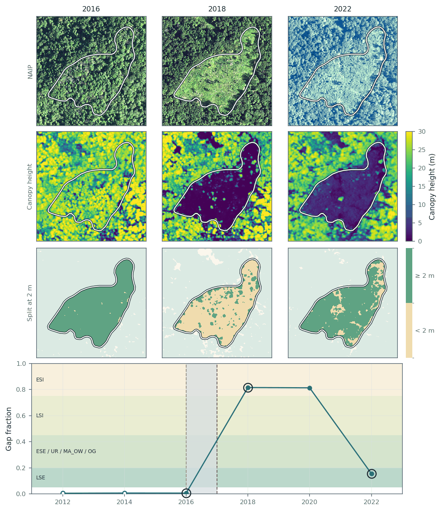

Stand `ELKNE-U9-0-0` is 11.4 acres of Indiana hardwood that interpreters mapped as a clearcut with reserves between the 2016 and 2017 imagery dates. The three columns are the last image before the cut, the first image after it, and the stand four years into recovery.

The bottom image row is the metric before it is reduced to a number. It splits the canopy height model at 2 m and washes out every pixel whose centre falls outside the polygon, because those pixels are not counted. Gap fraction holds near 0.007 through 2016, rises to 0.816 in 2018, stays at 0.813 in 2020, and falls to 0.156 by 2022. The green islands scattered through the 2018 panel are the reserve trees the harvest left standing, which is why the value stops well short of 1.0.

The 2022 column is the one to read carefully. Gap fraction says 0.156, so 84 percent of the stand is canopy again. The canopy height panel directly above it is almost uniformly dark: mean canopy height inside the stand is 4.6 m and the 90th percentile is 7.2 m. `gap_fraction` counts pixels against a threshold and says nothing about height above it. A stand of six-year-old saplings and a closed mature stand can return the same value. Read it alongside `height_mean` or `tall_canopy_fraction`.

The shaded bands are the `gap_fraction` envelopes for each stage under site type `type_00`. Two things stand out. The three pre-disturbance dates sit at 0.007, below the 0.05 floor of the lowest band, so a closed mature hardwood stand falls outside every `gap_fraction` envelope in the current table. After the cut the stand lands squarely in ESI, and by 2022 it is back inside LSE at 0.156.

The band between 0.20 and 0.45 belongs to ESE, UR, MA_OW and OG at once. No date in this series lands there, but the stand passes through it twice between observations. Gap fraction alone cannot tell those four stages apart, which is why a stage assignment evaluates seven metrics together rather than any one of them.

[Back to the gap_fraction entry](#gap_fraction)

### gap_fraction: a stand that closes again

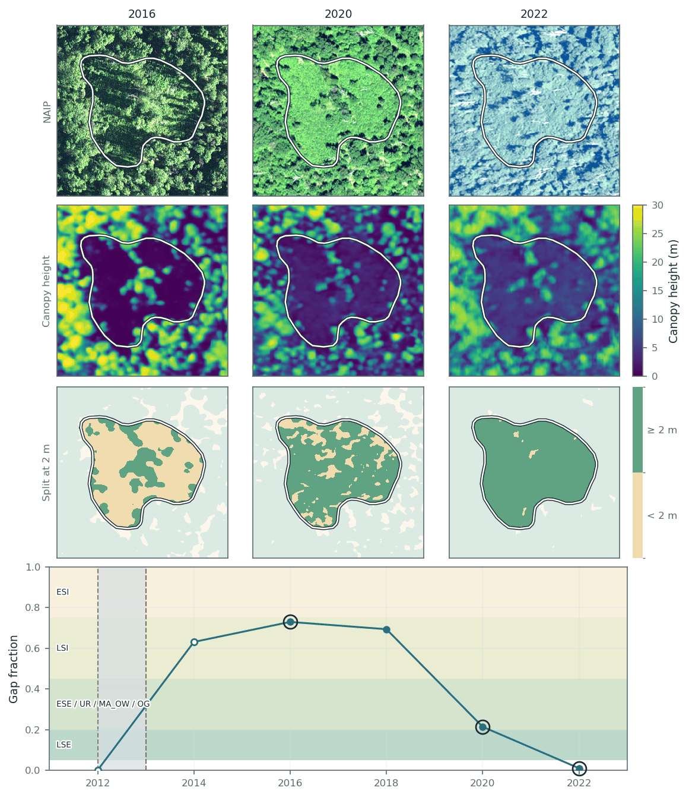

Stand `ELKNE-U4-0-0` is 2.6 acres cut between the 2012 and 2013 imagery dates. It is the other half of the story above. `U9` is caught mid-recovery, while this stand runs the full arc inside the NAIP record.

Gap fraction reads 0.002 in 2012, before the cut. It peaks at 0.730 in 2016, falls to 0.215 by 2020, and reaches 0.011 in 2022. The bottom row tracks it: mostly open in 2016, mixed in 2020, and a solid canopy class in 2022 with only a few scattered gaps left. The columns skip 2012 because it is 1.0 m native imagery, and a resolution change inside a figure about a change in the forest is a confound. The clearcut figure above already shows what an intact stand looks like.

The same caution applies harder here. In 2022 the stand reads 0.011, which is effectively closed, on a mean canopy height of 6.4 m. Nine years after a clearcut the metric has returned to its pre-disturbance value while the stand is still a thicket of young stems. Any use of `gap_fraction` to infer recovery has to be paired with a height metric.

At 2.6 acres this stand falls below the minimum mapping unit in `examples/screen.py`, so it is a documentation example rather than a calibration stand.

[Back to the gap_fraction entry](#gap_fraction)

### gap_persistence: what a fresh opening looks like

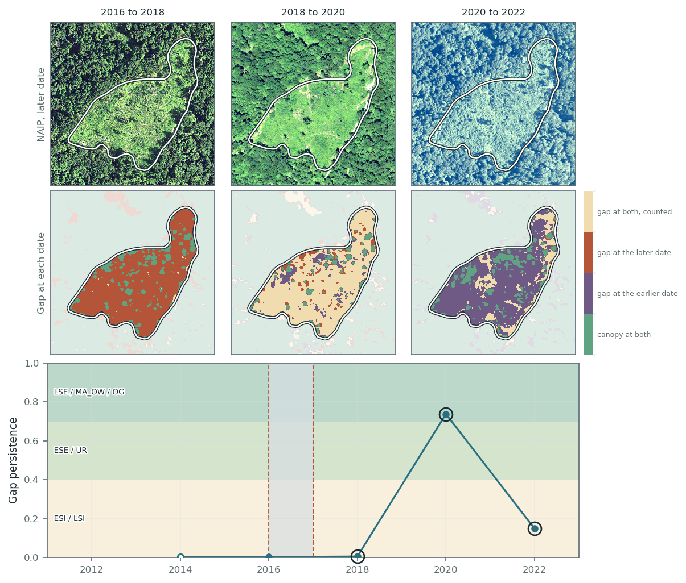

Stand `ELKNE-U9-0-0` is the 11.4 acre clearcut with reserves from the first figure in this section, drawn again so the two can be read together. Each column here covers a pair of dates rather than one date, because the metric compares a canopy height model against the one before it.

The middle row is that comparison, pixel by pixel. Four classes cover every case: canopy at both dates, gap at the earlier date only, gap at the later date only, and gap at both. The last class is the numerator, and it is the only one the metric counts.

Read the 2016 to 2018 column first. The harvest fell between the two images and the stand is almost entirely red, which is gap at the later date only. Gap fraction reads 0.816 in 2018. Gap persistence reads 0.007, from 498 pixels out of 75,515. Neither number is wrong. A pixel opened in 2017 was canopy in 2016, so it fails the both-dates test, and the metric was never built to notice that it changed.

The value arrives one date later. By the 2018 to 2020 pair the opening has been present for both images, 55,694 pixels qualify, and gap persistence reads 0.738. In the 2020 to 2022 pair most of the stand has closed again and the purple class takes over, which is gap at the earlier date only. The value falls to 0.149.

So the series peaks two years after the harvest and sits at its pre-harvest level on the date of the harvest itself. A trajectory rule that fires on persistent opening cannot see a fresh clearcut. Pair it with `d_gap_fraction`, which is computed across the same date pair and does see one.

The shaded bands make a second problem visible. The 2020 value of 0.738 lands in the band shared by LSE, MA_OW and OG, the three closed-canopy stages, on a date when 81 percent of the stand is bare ground. The three dates before the harvest sit in the ESI and LSI band, which is where a stand at the very start of its life belongs. The envelopes and the metric point in opposite directions here and across the whole module. See [Known gaps](#known-gaps).

[Back to the gap_persistence entry](#gap_persistence)

### height_mean: a clearcut, and a mean that rises as the stand opens

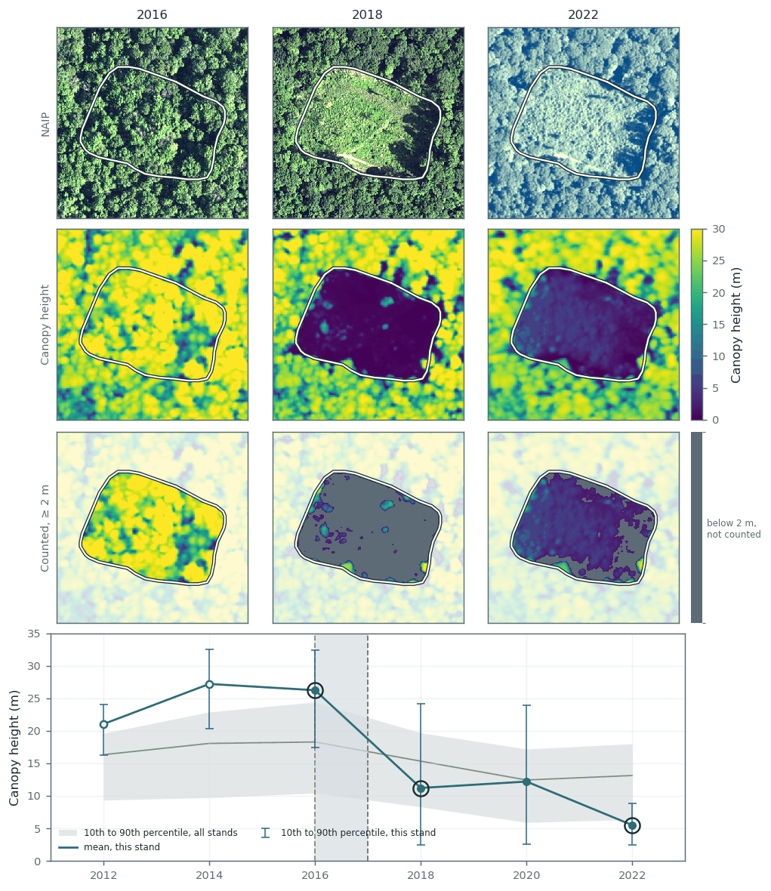

Stand `ELKNE-U13-0-0` is 3.3 acres that interpreters mapped as a clearcut between the 2016 and 2017 imagery. The three columns are the last image before the cut, the first image after it, and the stand five years on.

The third row is what the metric actually averages. `height_stats` drops every pixel below 2 m before it computes anything, so the grey pixels in that row are inside the stand and still contribute nothing. In 2016 almost none are grey: 37,372 of 37,376 in-stand pixels clear the threshold and the mean is 26.24 m. In 2018 only 5,792 do. The mean falls to 11.20 m and the 90th percentile to 24.11 m, held up by the scattered survivors the third row shows as islands in the grey.

Now read 2018 against 2020, which is the pair that matters. Gap fraction rises from 0.845 to 0.894, so the stand is more open. Mean height also rises, from 11.20 m to 12.19 m. Both numbers are correct. The sample fell from 5,792 pixels to 3,952 between the two dates, and what left it were the shortest members. Removing the bottom of a distribution raises its mean. The metric went up because the stand lost canopy.

By 2022 the sample has jumped to 29,033 pixels and the mean has fallen to 5.48 m, the lowest in the series. The whiskers are the 10th to 90th percentile of the canopy pixels at each date, and they carry the rest of the story. In 2018 and 2020 they run from about 2.4 m to about 24 m, which is not a spread around a central value. It is two populations, a few tall survivors and a floor of new stems, and a mean sits in the empty space between them where no pixel is. By 2022 the whisker has closed to 2.5 to 8.8 m and the mean describes something real again.

The grey band is the 10th to 90th percentile across all 40 stands at each date. It sags through 2018 and 2020 for reasons that have nothing to do with this stand. See [Known gaps](#known-gaps).

[Back to the height_mean entry](#height_mean-height_median-height_p90-height_max)

### height_mean: recovery that pushes the mean down

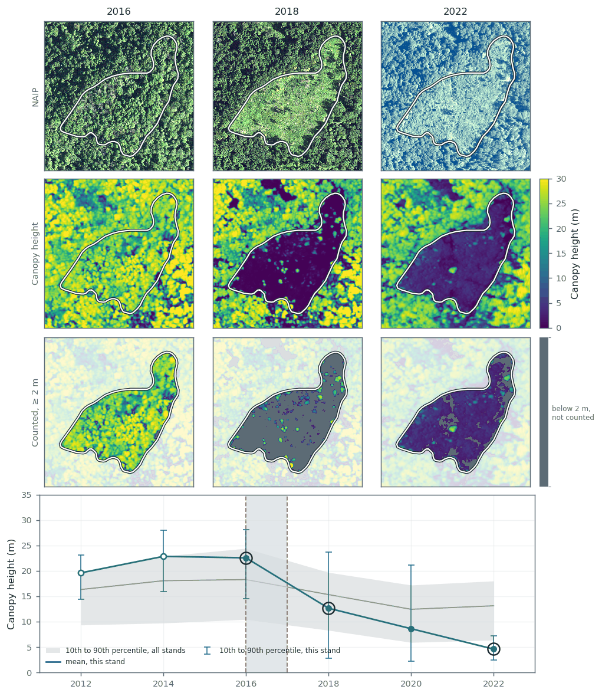

Stand `ELKNE-U9-0-0` is the 11.4 acre clearcut with reserves from the `gap_fraction` and `gap_persistence` figures above. The `gap_fraction` caption ends by telling the reader to pair that metric with this one. This is what happens when they do.

The reserve trees are easy to find in the middle column of the third row. They are the scattered bright points that survive the 2 m cut while everything around them turns grey. They are also why the 90th percentile barely moves at first. It reads 28.06 m in 2016, 23.70 m in 2018 and 21.19 m in 2020, across a harvest that took 82 percent of the canopy. Twenty-three thousand pixels out of 128,029 clear the threshold on those two post-harvest dates, and almost all of them are reserve trees.

The mean tells a different story over the same dates, falling from 22.56 m to 12.63 m to 8.60 m. Then comes 2022. Gap fraction drops from 0.813 to 0.156, so 84 percent of the stand is canopy again and the stand is plainly recovering. Mean height drops from 8.60 m to 4.59 m, its steepest fall in the record. The 90th percentile drops with it, 21.19 m to 7.21 m.

Nothing got shorter. The sample grew, from 23,897 pixels to 108,068. Six-year-old regrowth crossed 2 m and joined a statistic it had been excluded from, and 84,000 new pixels two to five metres tall swamped the few thousand reserve trees that had been carrying the value. The steepest decline in this series is the date the stand recovered.

So the pairing the `gap_fraction` caption recommends does not work on its own. Gap fraction falling and height rising would mean recovery. Gap fraction falling and height falling means the same thing here. What separates the two cases is `support_n_valid_pixels` and the direction the sample moved, not the height at all. A trajectory rule that reads a falling `height_mean` as continued loss will misclassify every stand at the moment it closes.

[Back to the height_mean entry](#height_mean-height_median-height_p90-height_max)

### crown_cv: a stand with enough segments

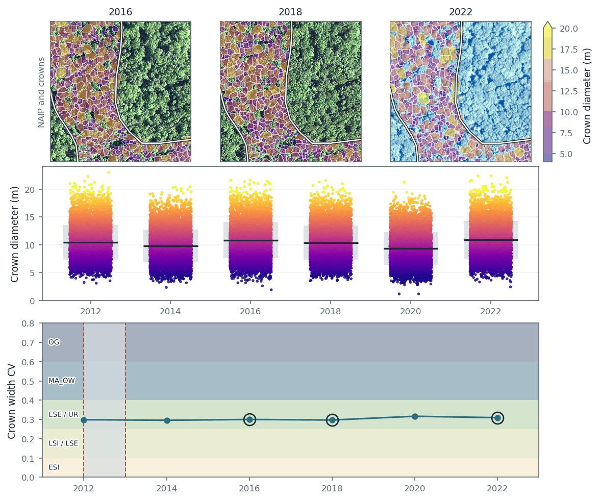

Stand `ELKNE-U44-0-0` is a 191 acre uneven-age selection harvest cut between 2012 and 2013. It carries between 5168 and 6646 segments at every date, far above the 75 crown support floor. If `crown_cv` works anywhere in this data set, it works here.

The top row is a 250 m detail box, not the whole stand. At full extent a 10 m segment is a few pixels wide. Segments are drawn only inside the stand, which is why they stop at the outline. Compare a coloured patch against the tree crowns visible beside it. Under the 2026 segmentation a segment is roughly one dominant crown, about 10 m across at 67 per hectare, where the same stand carries 200 to 600 stems. Subdominant trees are still missing, so read these as canopy patches rather than a stem map.

The middle row is the distribution the metric summarises, one dot per segment. `crown_cv` is the half width of the shaded band divided by the mean line. Across six dates and a selection harvest, neither moves. The mean holds between 9.3 and 10.9 m and the band keeps its width.

The series is flat at 0.296 to 0.317, inside the shared ESE and UR band at every date. A stand this large returns close to the scene value whatever happened to it, so `crown_cv` alone separates little here. `crown_mean` and `crown_p90` do move on smaller stands, and across the calibration set `crown_mean` separates pre-event from post-event states with an AUC of 0.08 against 0.73 for `crown_cv`. The old growth band continues past the top of the axis to 1.5. See [Known gaps](#known-gaps) and [the segmentation guide](guides/segmentation_optimization/README.md).

[Back to the crown_cv entry](#crown_cv)

### crown_cv: a stand that falls below the support floor

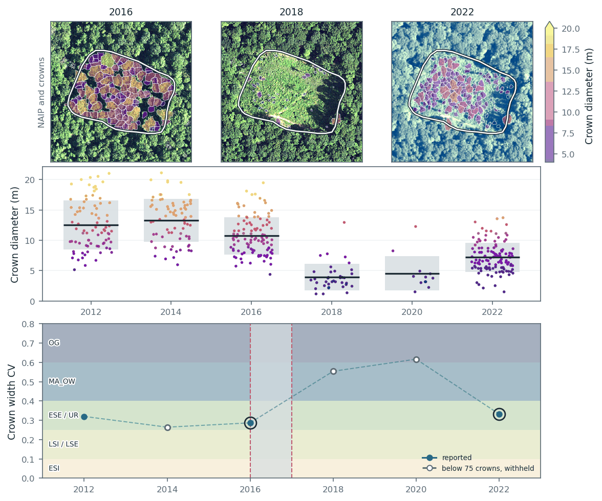

Stand `ELKNE-U13-0-0` is a 3.3 acre clearcut between 2016 and 2017. Same metric as the figure above, on a stand small enough that the sample size becomes the story.

Segment counts run 81, 73, 106, 37, 12 and 119 across the six dates. The middle row shows that collapse directly. In 2016 the stand holds 106 crowns averaging 10.7 m. In 2018 thirty-seven survive, averaging 4.0 m. By 2020 only twelve remain. In 2022 the regrowth carries 119 crowns averaging 7.2 m.

The bottom panel draws all six dates, but only the filled markers are reported. `MIN_CROWNS = 75` withholds 2014, 2018 and 2020, drawn hollow on a dashed line. The floor is the sample size at which the crown_cv interval becomes narrower than the narrowest stage band, so below it the metric cannot place a stand in a band. The withheld values are plotted rather than dropped because three isolated points with no line between them read as missing data, when the truth is a value the sample was too small to trust.

Read the hollow section and it is clear what the floor is protecting against. `crown_cv` climbs to 0.55 in 2018 and 0.62 in 2020, which would put a freshly clearcut stand in the MA_OW envelope for a mature forest or open woodland, the opposite of what happened on the ground. Twelve crowns produced that. Under the previous threshold of 3 the pipeline would have reported it.

A small stand therefore loses the metric exactly when it is disturbed, which is when a trajectory rule most needs it. Twenty-six of the forty stands in this module clear the floor at all. `crown_mean` has no such problem and tracks the disturbance closely, falling from 10.7 m to 4.0 m and recovering to 7.2 m.

Hollow markers mean a withheld value on this panel, not the coarser 1.0 m imagery they mean elsewhere in these figures. 2012 and 2014 are the 1.0 m dates here.

[Back to the crown_cv entry](#crown_cv)

### glcm_texture: the scene, not the forest

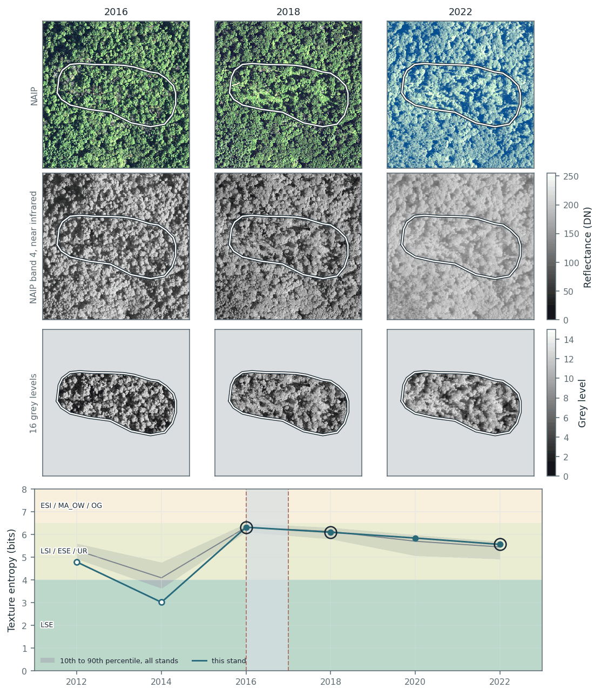

Stand `ELKNE-U47-0-0` is 6.6 acres of uneven-age selection harvest cut between the 2016 and 2017 imagery. A selection harvest takes scattered individual crowns and leaves the canopy otherwise intact, which is the disturbance a texture metric ought to be best at.

The three rows above the series take the metric apart. The second row is NAIP band 4, the near infrared band the metric reads, drawn at a fixed 0 to 255 stretch so the three dates are comparable. The third row is the same array quantized to the 16 grey levels the co-occurrence matrix counts, with everything outside the polygon drawn as nodata because no pair that touches it is counted.

Compare the second row across the columns. The in-stand values span 24 to 243 DN in 2016, 1 to 241 in 2018, and 107 to 225 in 2022, which is a little under half the range. The quantization stretch is refitted from those bounds each time, so the 2022 panel spends all 16 levels on half the tonal range and comes out looking no flatter than the others. The metric never sees that the scene changed.

The series is the consequence. The stand reads 4.79, 3.01, 6.31, 6.09, 5.84 and 5.56 bits across the six dates. The grey line is the median across all 40 stands in the module and reads 5.30, 4.09, 6.31, 6.13, 5.70 and 5.45. The stand tracks the module almost exactly, including a 3.3 bit rise between 2014 and 2016 when nothing happened on the ground at either date. The harvest itself moved the value 0.22 bits, from 6.31 to 6.09, while gap fraction went from 0.001 to 0.224.

The shaded band is the 10th to 90th percentile across those 40 stands. It runs 0.4 to 1.2 bits wide within a single date, against a 2.2 bit swing between dates. Variation between acquisitions is larger than every stand-to-stand difference in the module put together.

Two consequences follow for the stage envelopes. LSE occupies 0.0 to 4.0 bits, and in 2014 the module median falls inside it, which is a statement about the 2014 acquisition rather than about forty stands of Indiana hardwood. ESI, MA_OW and OG share a floor of 6.5 bits that only four of 240 stand-dates ever reach. Recalibrating those bands needs the interpreter labels and is not attempted here. See [Known gaps](#known-gaps).

[Back to the glcm_texture entry](#glcm_texture)

### edge_density: a clearcut and its regrowth

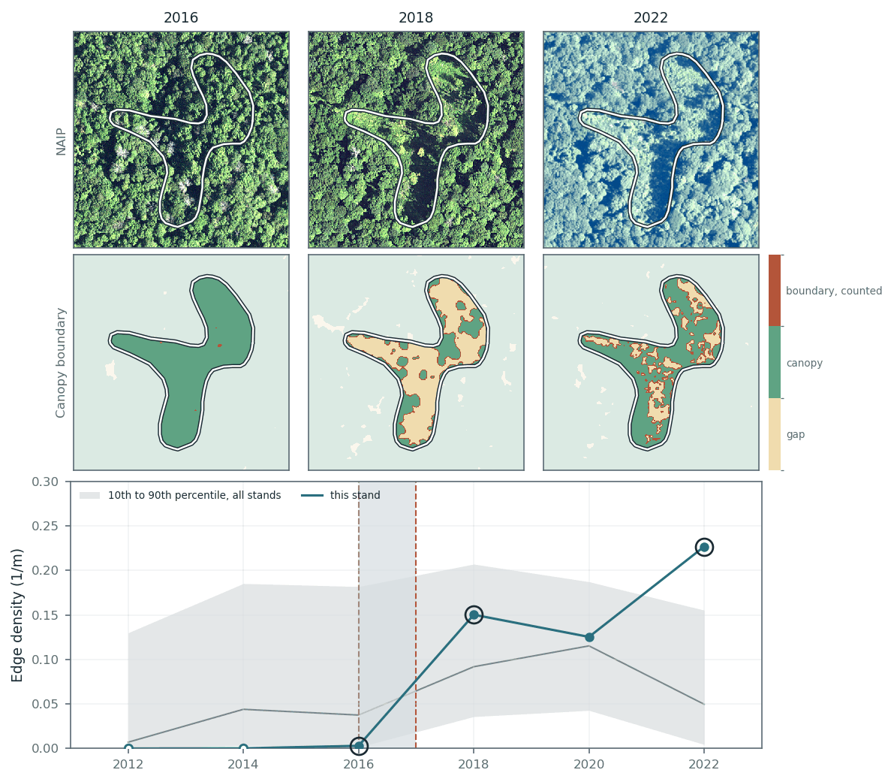

Stand `ELKNE-U12-0-0` is 3.2 acres, a clearcut with reserves taken between the 2016 and 2017 imagery.

The middle row is the metric. It splits the canopy height model at 2 m, runs the same `interior_edge_mask` the metric calls, and paints the pixels that mask returns. Those really are the counted pixels. The row is drawn at the native 0.6 m resolution rather than decimated, because the length of a boundary traced across a raster scales with the pixel size. Count the painted pixels, multiply by 0.6 m, divide by the 12,869 m² of stand, and the plotted value comes back exactly: 65 boundary pixels in 2016, 3,223 in 2018 and 4,865 in 2022.

The value peaks in 2022, four years after the harvest, not at it. Edge density reads 0.003 in 2016, 0.150 in 2018 and 0.227 in 2022. Gap fraction over the same three dates reads 0.001, 0.659 and 0.262. The 2018 panel shows why. A fresh clearcut is one large opening with a short internal boundary, and two thirds of the stand is inside it. By 2022 regrowth has broken that opening into scattered patches, so a quarter of the stand is gap and the boundary is half as long again.

Nothing in the current classification reads this metric. It has no stage envelope and no trajectory rule, and only its change term `d_edge_density` carries a V5 code. The backdrop is therefore the module itself, the 10th to 90th percentile across all 40 stands at each date with the median drawn through it.

Read the value as the pattern of removal. It carries no information about the amount removed, and the next figure shows it running the other way.

[Back to the edge_density entry](#edge_density)

### edge_density: a selection harvest with more edge

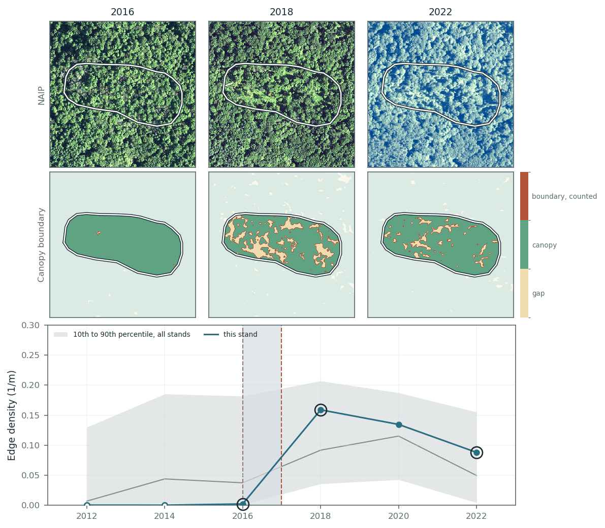

Stand `ELKNE-U47-0-0` is the 6.6 acre selection harvest from the texture figure. The comparison against the clearcut above is the point of drawing it.

In 2018 this stand reads 0.159 on a gap fraction of 0.224. The clearcut reads 0.150 on a gap fraction of 0.659. Almost the same length of canopy boundary comes out of a third of the opening. The middle row shows the arrangement that does it. Dozens of small gaps sit where individual crowns were taken, each one ringed with boundary, against one large hole with a single perimeter.

The two stands then diverge. This one falls to 0.088 by 2022 as the small gaps close, while the clearcut climbs to 0.227 as its large opening breaks up. Both stands are recovering, and edge density moves in opposite directions.

One value on its own therefore says nothing about severity. Paired with `gap_fraction` it says a good deal: high edge on low gap is a selective removal, low edge on high gap is a stand-replacing one. That pairing is what `d_edge_density` was meant to support.

[Back to the edge_density entry](#edge_density)

### row_directionality: what the transform sees

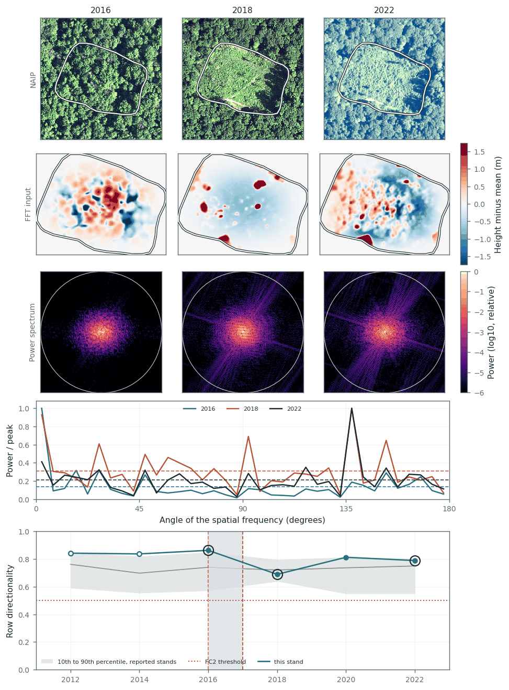

Stand `ELKNE-U13-0-0` is 3.3 acres of Indiana hardwood mapped as a clearcut between the 2016 and 2017 imagery. It is one of only two interpreter-labelled stands that clear the 0.50 support gate, and the only one whose value moves on the date of its disturbance. The three middle rows take the metric apart.

The second row is the array the transform receives, which is not the canopy height model. Every pixel outside the polygon has been filled with the in-stand mean, the global mean has been subtracted, and a Hanning window has been applied. The surround therefore sits at exactly zero and reads flat, and the taper darkens the border of every panel. Read the 2018 column against 2016. After the harvest the inside of the polygon is nearly as flat as the filled surround, with a handful of surviving crowns left as isolated peaks.

The third row is the power spectrum, shifted so zero frequency is at the centre, with the circle marking the outer edge of the analysed annulus. Structure that runs one way on the ground appears here turned 90 degrees, so a stand of rows would show a streak across the centre perpendicular to the rows themselves. No column shows one. What 2016 shows is a radially symmetric blob, which means power falls off with frequency and favours no direction at all. The 2018 and 2022 columns add a bright cross and a set of diagonal rays, which come from the straight canopy boundaries the harvest left, not from any repeating pattern.

The fourth row is the reduction. Power is summed into 36 angular bins of 5 degrees each, and each date is divided by its own tallest bin so the three can share an axis. The dashed line is that date's mean over the peak, and the metric is one minus its height. Two things are visible. The profiles are spiky rather than lobed, which is what an isotropic spectrum looks like once it is chopped into bins. The tallest bin is the first one in 2016 and the one near 135 degrees in 2022, and neither corresponds to anything in the imagery.

The series reads 0.841, 0.836, 0.862, 0.688, 0.812 and 0.788. The harvest moves it from 0.862 to 0.688, a fall of 0.173. Over the same record three undisturbed stands move further between consecutive dates with nothing happening to them: `U26` by 0.201, `U4` by 0.201 and `U27` by 0.193. The largest clearcut in the file produces a smaller change than the year-to-year wobble of stands that were never cut.

The dotted line is the FC2 threshold. Every date on this stand sits above it, including the three before the harvest, and so does the shaded band holding the middle 80 percent of every stand the gate reports. The next figure says why.

[Back to the row_directionality entry](#row_directionality)

### row_directionality: what a value means

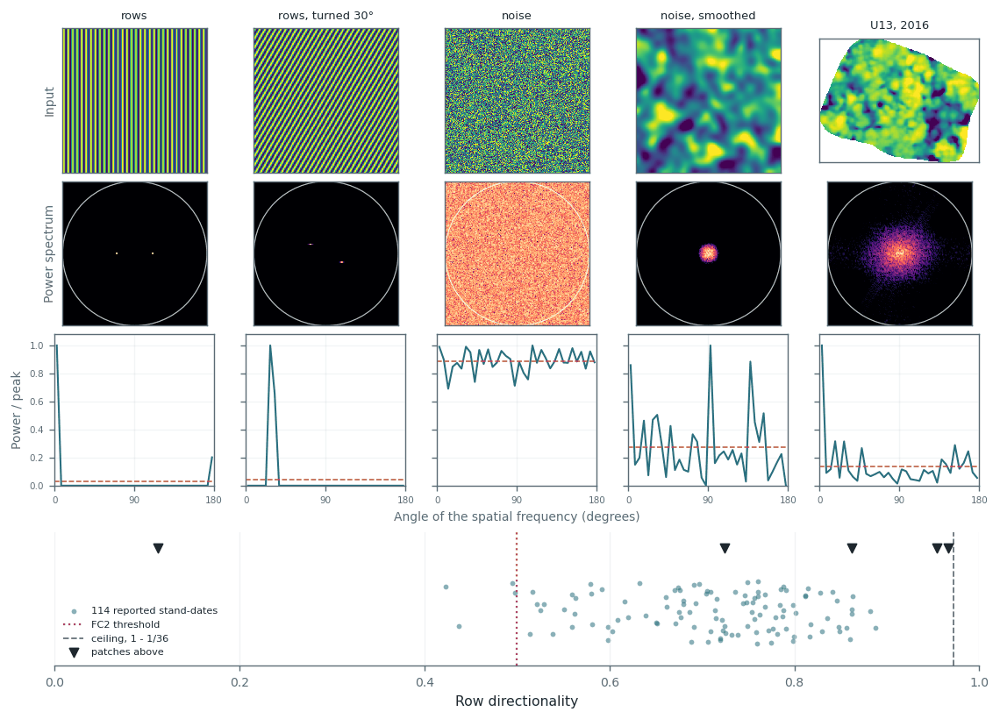

The metric is uncalibrated, so a value means nothing until something anchors it. The four left-hand columns are synthetic patterns built in the script, and the fifth is the real stand from the figure above. Every value is computed by `fft_directionality` itself at draw time, so none of them is asserted.

Read the columns in pairs. Regular rows return 0.967, just under the 0.972 ceiling, and their spectrum is two bright points. Turning those rows 30 degrees returns 0.954 and moves the points around the centre, which confirms the metric has no preferred orientation. White noise returns 0.111 with a spectrum that fills the disc evenly and a profile that hugs its own mean.

The pair that matters is the third column against the fourth. They are the same random field. Nothing directional was added between them. The only change is a Gaussian blur, and the value goes from 0.111 to 0.724. Blur it further and it keeps climbing, reaching 0.850 at a 16 pixel radius. The metric responds to how smooth a surface is, and a canopy height model is a smooth surface.

The fifth column is the consequence. Stand `U13` in 2016 returns 0.862, and its spectrum is the same compact blob as the blurred noise beside it. A closed hardwood canopy with no rows in it scores higher than most of what the metric was built to find.

The bottom row places every reported value in the module on the same axis. All 114 of them fall between 0.42 and 0.89, and 110 clear the FC2 threshold of 0.50. A rule written to identify row-structured plantations therefore selects almost every ordinary hardwood stand-date in the calibration set. Nothing in Elkinsville NE is a plantation.

Two limits on reading this figure. The synthetic patches are square and noise-free, while a real stand is an irregular polygon carrying nodata, so treat their values as endpoints rather than as a calibration curve. And the metric is not broken in the sense of being wrong about its own arithmetic. It computes what it says it computes. It is the interpretation of that arithmetic as row structure that does not hold. See [Known gaps](#known-gaps).

[Back to the row_directionality entry](#row_directionality)

### ndvi_mean: a clearcut the aerial record missed

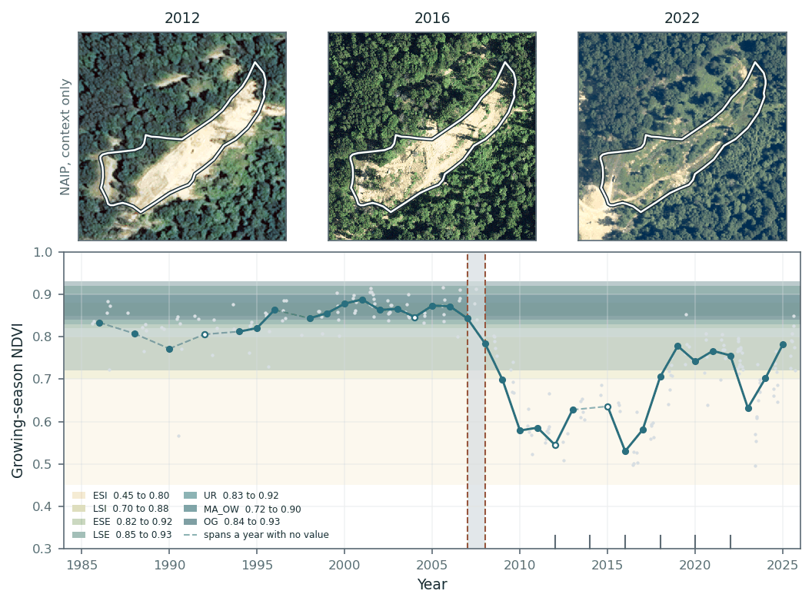

Stand `ELKNE-U16-0-0a` is 2.8 acres clearcut between the 2007 and 2008 imagery, which is before the NAIP record used elsewhere in this document begins. `config/stages.yaml` already cites it as its own worked example. The three panels along the top are context, and nothing on the figure is computed from them. They show the stand still open in 2012 and 2016, with regrowth taking hold by 2022.

The lower panel is the whole Landsat record, one value a year from 1985. Each faint dot behind the line is a scene that survived quality control and fell inside the growing-season window, 1 June to 15 September. There are 209 of them across 41 years, drawn from 551 clear observations and 977 raw ones. Most of what quality control removed, 362 observations, was scenes where every pixel of this 2.8 acre stand was masked.

The signal is large and it runs in both directions. The stand holds between 0.84 and 0.89 through the 1990s and early 2000s. It falls after the harvest to 0.58 by 2010 and bottoms at 0.53 in 2016. It recovers to 0.78 by 2025. Seven years report no value, and the six dashed segments are where the line crosses them. Three more years rest on the three-observation floor and are drawn hollow.

The shaded bands are the seven stage envelopes, and they are named in the legend rather than beside the bands as they are on every other figure here. Six of the seven sit between 0.70 and 0.93 with their midpoints within 0.02 of each other, so no font size fits a stage code against each one. That crowding is the honest picture of a metric which saturates over closed canopy. The one band that separates is ESI, at 0.45 to 0.80, and this stand sits inside it for fifteen years after the cut. The legend swatches are drawn more opaque than the bands, because six overlapping bands composite to something near white on the axis itself.

That length of signal is unusual, and it comes from a stand that never regrew. Stand `ELKNE-U13-0-0` lost 85 percent of its canopy between the 2016 and 2018 imagery. Its growing-season NDVI moved from 0.854 in 2016 to 0.729 in 2017, then back to 0.845 in 2018 and 0.892 in 2019, while the canopy height model still read a gap fraction of 0.845 in 2018 and 0.894 in 2020. One year of dip, 0.125 deep, for a stand-replacing harvest. Herbaceous and shrub regrowth is green, and NDVI cannot tell it from a canopy.

[Back to the ndvi_mean entry](#ndvi_mean)

### ndvi_seasonal_amplitude: the cycle behind the number

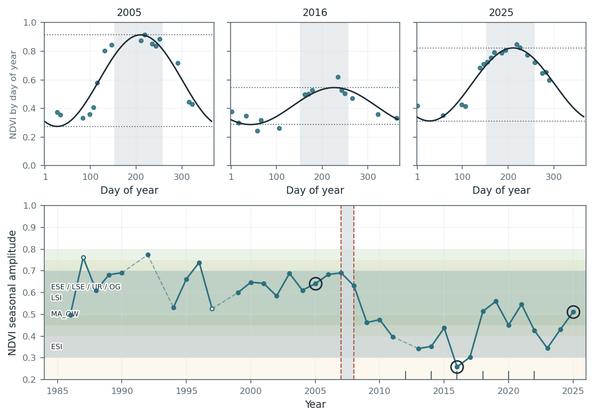

Same stand. The top row is the metric before it is reduced to one number, at three years spread across the record.

Each panel holds every clear observation in that calendar year plotted against day of year, with the single harmonic fitted through them. The two dotted lines are the modelled peak and trough, so the distance between them is the value reported below. The shaded strip is the 1 June to 15 September window that `ndvi_mean` averages over, drawn to show how much of the cycle the level metric never sees. Amplitude uses the whole calendar year on purpose, because the winter trough is half the signal.

The three years are 2005, before the harvest, 2016, at the bottom of the decline, and 2025, twenty years on. The fits rest on 16, 15 and 18 observations spanning 296, 360 and 288 days, and they return 0.641, 0.259 and 0.511. The 2016 panel is the one to look at. The observations are real and well spread, the fit is a clean curve with an `r2` of 0.83, and the cycle it describes is less than half as deep as the one beside it. A stand of grass and shrubs still greens up and still senesces. It does less of both.

The fitted peak lands on day 210 in 2005, day 227 in 2016 and day 211 in 2025. A southern Indiana hardwood stand peaks near day 190 and maize near day 215, so the phase is a free check on a fit that has already passed every numeric guard.

Four guards fire in a fixed order: fewer than six observations, a day-of-year span under 150 days, a design matrix condition number above 30, then an amplitude above 1.5. Five of the 41 years here fail one of them. `r2` is recorded and is deliberately never a guard, because a modest `r2` is what a closed canopy produces and gating on it would void the stands the classifier most needs.

Amplitude separates cover types rather than developmental stages. It is what tells deciduous forest from pasture, agriculture and evergreen cover, and LC1, LC3 and LC5 are the rules that read it.

[Back to the ndvi_seasonal_amplitude entry](#ndvi_seasonal_amplitude)

### ndvi_trend: the slope and its interval

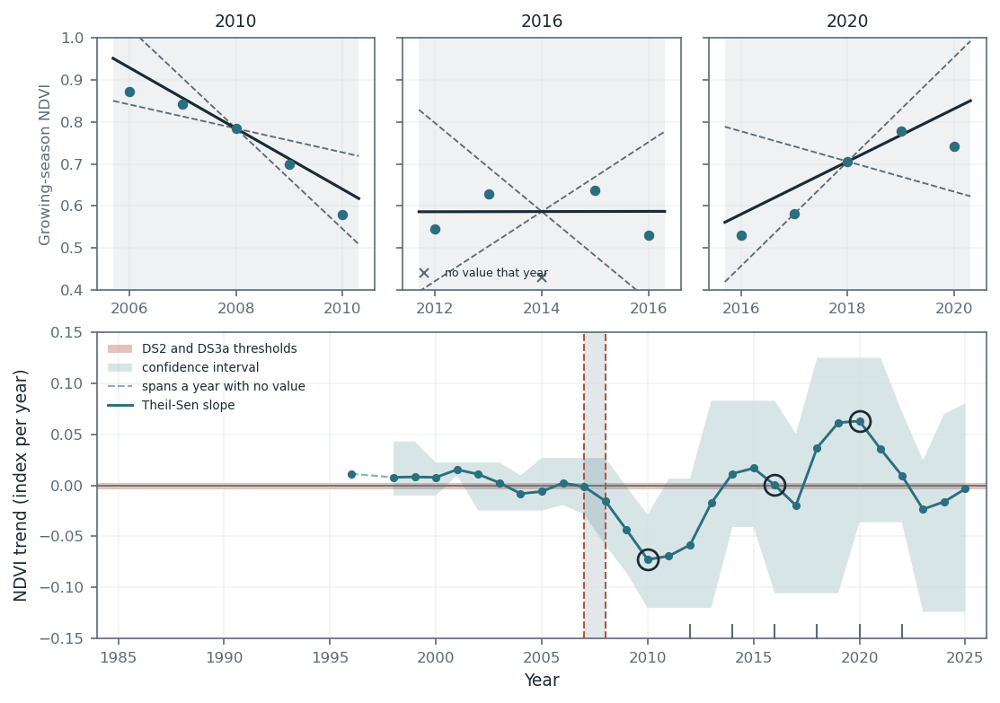

Same stand again. The top row is three trailing five-year windows of the growing-season mean, each labelled at its last year, which is where the metric reports the value.

The dots are the yearly levels. The solid line is the Theil-Sen slope through them, the median of all pairwise slopes, so one cloudy year cannot set the sign the way it can with least squares. The two dashed lines are the low and high ends of the confidence interval `scipy.stats.theilslopes` returns, drawn through the same median point so that only their slope differs.

Those dashed lines are the figure. The 2010 window returns -0.073 per year with an interval of -0.120 to -0.029. Both ends fall below zero, so the decline is a statement. The 2016 window returns 0.0002 with an interval of -0.106 to 0.083. Its two dashed lines cross inside the panel, because the four points it rests on carry no direction at all. The 2020 window returns 0.063 with an interval of -0.036 to 0.125, a recovery the data support without ruling out a flat series. Read as slopes alone those three are a decline, nothing, and a recovery. Read with their intervals, the first is solid and the third is suggestive.

The 2016 panel also carries a year the level metric withheld. 2014 rested on two observations against a floor of three, so the window used four points rather than five. The metric accepts that down to `min_years = 4` and reports the slope anyway.

The lower panel carries the interval as a band across the whole record. The narrow strip at zero holds both trajectory thresholds, DS2 at -0.004 and DS3a and EF3 at 0.002. They sit within 0.006 of each other and of zero, which is far narrower than the interval on any window in this record. Testing either threshold without also reading the interval turns a coin flip into a classification.

No stage envelope constrains this metric, on purpose. A rate has no meaning in a single-date envelope.

[Back to the ndvi_trend entry](#ndvi_trend)
